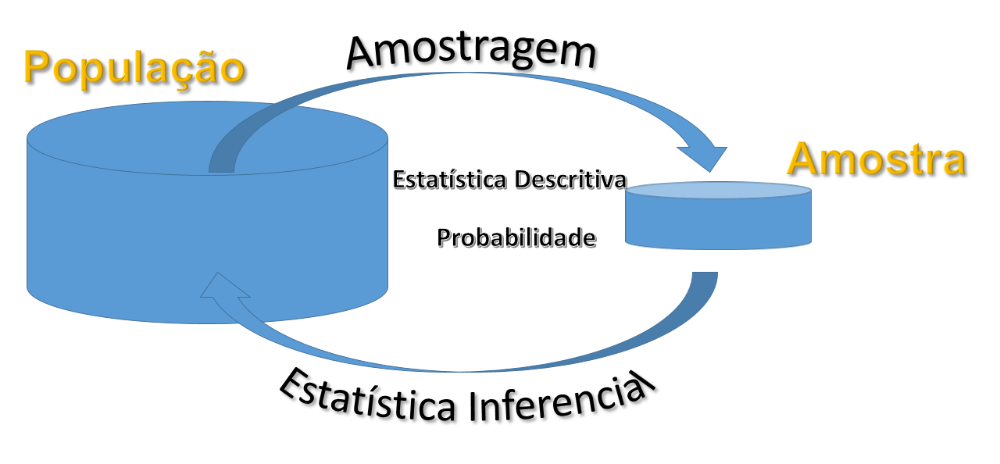

---
output:
  pdf_document: default
  html_document: default
---

```{r setup, include=FALSE}
knitr::opts_chunk$set(echo = FALSE)
library(ggplot2)
```


# Definições Gerais da Estatística e técnicas de somatórios {#dgets}

## Introdução

Em pleno século XXI, passamos por um processo de transformação na era digital. Uma grande massa de informações surge instantaneamente a cada momento sobre os mais diversos temas possíveis. Por exemplo, nas redes sociais quando percebemos o número de curtidas de uma determinada declaração, número de downloads de um determinado vídeo, a repercussão que determinada declaração proporciona, o número de propagandas, etc, tudo isso cria um grande banco de dados sobre os usuários, que hoje se torna mais valiosa do que a própria moeda local. Isso é a nova revolução chamada "Big Data". Por meio de grande banco de dados, podemos por exemplo, traçar um perfil dos usuários, como eles se comportam, quais as suas preferências, escolhas, diversão, etc. Contudo, o entendimento dessas informações podem não ser tão claras, ou devido a complexidade do problema, ou pela quantidade de informações recebidas rapidamente, ou outros fatores. Diversos outros exemplos poderiam ser citados, tudo isso para mostrar a necessidade de entender o que está por trás desses dados, cuja compreensão é o grande objetivo nessa era global.

Nesse enfoque, temos a Estatística como Ciência que fornece métodos para coleta, organização, descrição, análise e interpretação de dados (observacionais ou experimentais) e para a utilização dos mesmos na tomada de decisões. Os dados são informações retiradas de um conjunto de elementos de interesse. Podemos estar interessados na Produção anual de Gás Natural Não associado com o petróleo (GASN) de um determinado país, e ao longo dos anos, coletarmos informações para ao final, por exemplo, termos informações que nos indique o potencial energético desse recurso natural nesse local ou consequências dessa fonte energética na economia do país.

Assim, por meio da utilização de técnicas estatísticas, tentamos entender as informações contidas nos dados. Devido a complexidade dessas informações em algumas situações, o estudo sobre essas técnicas têm aumentado, fazendo parte do nosso cotidiano. Nessa era digital, a grande quantidade de informações é gigantesca e valiosa, e as empresas tentam entender o que está por trás desses dados, ou você acha que o Facebook foi criado simplesmente para gerar entreterimento às pessoas? Ou você também acha que o Google criou uma plataforma de pesquisa simplesmente para facilitar a vida das pessoas? Algo muito nobre está por trás de tudo isso, os dados.

No passado, tratar uma grande massa de números era uma tarefa custosa e cansativa, que exigia horas de trabalho tedioso. Porém, hoje, esse volume de informações pode ser analisado rapidamente por meio de um computador pessoal e programas adequados. O computador contribui positivamente na difusão e uso dos métodos estatísticos. Você já se perguntou como é que lojas virtuais lhe oferta produtos sendo que nunca acessou aquele site antes? Já percebeu que o Netflix quando lhe oferece uma série a tela de entrada as vezes se altera? Tudo isso é fruto das técnicas de máquinas de aprendizagem (do inglês, *Machine Learning*), uma área da inteligência artificial. Juntamente com a estatística, essas ferramentas estão presentes em várias das tecnologias que utilizamos hoje.

## Definições gerais da Estatística

Inicialmente, podemos dividir a Estatística em três ramos:

- Estatística Descritiva;
- Probabilidade;
- Estatística Inferencial.

Definimos cada uma dessas áreas a seguir. A primeira delas é a Estatística Descritiva, apresentada na (\#def:estdescritiva).

<div id="def:estdescritiva" class="definicao" cap=1 titulo="(Estatística Descritiva ou Estatística Dedutiva)">
Um conjunto de técnicas estatísticas destinadas a coleta, descrição e sintetização dos dados, a fim de podermos entender características de interesse da população^[Ver Definição [1.6](#def:populacao)], é chamada de Estatística Descritiva ou Estatística Dedutiva.
</div>

As técnicas mencionadas na Definição \@ref(def:estdescritiva) são: coleta, organização, tabulação, representação gráfica, bem como medidas que sintetizam todas as informações contidas nos dados.

As quatro primeiras técnicas serão abordadas no Capítulo \@ref(chap:coad). As medidas serão estudadas nos Capítulos \@ref(chap:mp) e \@ref(chap:md). Essa fase é de grande relevância, pois com base na Estatística Descritiva podemos sintetizar as informações contidas nos dados, e torná-las mais compreensíveis que de outro modo seriam complexas de serem entendidas.

No Capítulo \@ref(chap:sampling), daremos uma maior ênfase sobre a definição de uma população. De modo simples, podemos definir como um conjunto de elementos com uma característica em comum. Uma vez definida a característica que delimita essa população (Ver Subseção \@ref(subsec:est-pesqcient)), e também a característica de interesse (chamada de variável) da pesquisa, faremos a coleta dos valores observados da variável em cada elemento da população ou de um subconjunto (amostra). Os valores observados são chamados de dados.

<div id="def:dado" class="definicao" cap=1 titulo="(Dado ou valor observado)">
A característica de interesse observada em cada elemento da população é definida como valor observado ou dado.
</div>

Todas as técnicas mencionadas anteriormente auxiliam na descrição dos dados, uma não necessariamente sobrepõe a outra.  Vejamos, a @BP2018 lançou o relatório técnico de 2018 sobre os diversos tipos de produção de energias dos países, e na Figura \@ref(fig:prodcons) é mostrado um gráfico que sintetiza a produção e o consumo de petróleo do Brasil, em milhões de barris por dia (MMbbl/d), nos períodos de 2007 a 2017.

```{r prodcons, echo=TRUE, fig.cap="Produção e consumo de petróleo do Brasil nos períodos de 2007 a 2017."}
# BP Statistical Review 2018

# Producao e consumo de petroleo no brasil (Milhares de barris por dia)
ano  <- as.factor(c(2007:2017, 2007:2017))
prodcons <- c(1831, 1897, 2029, 2137, 2179, 2145, 2110, 2341, 2525, 2608, 2734, 2308, 2481, 2498, 2716, 2839, 2915, 3124, 3242, 3181, 3013, 3017)
id <- c(rep("Produção", 11), rep("Consumo",11))

# Objeto que armazena as informações
dados <- data.frame(ano, Legenda = id, prodcons)

# Funcao para criacao do grafico de barras
ggplot(dados, aes(x=ano, y=prodcons, fill=Legenda)) +
  geom_bar(position="dodge", stat="identity") +
  xlab("Ano") + ylab("Petróleo (Milhões de barris por dia)")
```

O gráfico nos revela que o Brasil produz petróleo abaixo do que necessitaria para o consumo, de tal modo que a produção é 27,71\%  a menos do que o consumo. Isso explica o porquê do Brasil como grande produtor de petróleo, ainda assim, necessita importar essa fonte de energia. Contudo, o gráfico não apresenta um resumo perfeito. Por exemplo, mesmo a produção de petróleo sendo mais baixa do que o consumo, o coeficiente de variação (assunto abordado no Capítulo \@ref(chap:md) dessas dos dados dessas variáveis, são 12,99\% e 10,93\%, respectivamente, calculados de acordo com a Tabela \@ref(tab:prodcons2). Isso implica, que as variações da produção de petróleo são maiores do que as do consumo, no Brasil. Observe que essas últimas informações não podem ser vistas facilmente na Figura \@ref(fig:prodcons), mas juntamente com o auxílio das medidas numéricas (medidas de posição e dispersão) e as medidas gráficas, podemos complementar as  informações, e assim, obter uma melhor descrição sobre essas informações.

```{r prodcons2}
ano  <- as.factor(c(2007:2017, 2007:2017))
prodcons <- c(1831, 1897, 2029, 2137, 2179, 2145, 2110, 2341, 2525, 2608, 2734, 2308, 2481, 2498, 2716, 2839, 2915, 3124, 3242, 3181, 3013, 3017)
id <- c(rep("Produção", 11), rep("Consumo",11))
# Objeto que armazena as informações
dados <- data.frame(Ano = ano, Tipo = id, Volume = prodcons)
knitr::kable(dados, caption = "Volume, em MMbbl/d, da Produção e consumo de petróleo do Brasil nos períodos de 2007 a 2017.")
```

Quando precisamos extender as informações contidas em um subconjunto (amostra) de dados para todo o conjunto (população), necessitamos de técnicas específicas dentro da estatística para garantir que estas informações sejam o mais verossímil possível. Técnicas estas são chamadas de Estatística Inferencial, definida a seguir.

<div id="def:estinf" class="definicao" cap=1 titulo="(Estatística Inferencial ou Estatística Indutiva)">

O estudo de técnicas que visam extender (extrapolar) a informação contida na amostra à população, chamamos de Estatística Inferencial ou Estatística Indutiva.
</div>

As técnicas abordadas na Estatística Inferencial estão relacionadas a determinar características (parâmetros) populacionais desconhecidas, ou até mesmo fazer afirmações sobre esses parâmetros.

A determinação de parâmetros por meio de características amostrais (estimadores) que chamamos de Estimação será abordado no Capítulo \@ref(chap:teoest). As afirmações realizadas sobre estes parâmetros, chamadas de hipóteses, serão estudadas no Capítulo \@ref(chap:teodec).

A Definição [1.3](#def:estinf) nos mostra que por meio da Estatística, podemos tomar decisões sobre uma população através da amostra. Isso se faz necessário muitas vezes em uma pesquisa, devido a duas coisas preciosas: tempo e dinheiro. Muito embora, se tivermos acesso a todos os elementos de uma população, não se faz necessário o uso de técnicas da inferência estatística, e daí realizamos o que chamamos de Censo.

A forma de como se obter uma amostra é um dos passos mais importante em todo o processo da análise, uma vez que não adianta está com todo o aparato técnico se as informações contidas nessas amostra não são representativas da população. Para isso, temos uma área na estatística chamada Amostragem, que será responsável pelo desenvolvimento de métodos de como selecionar os elementos populacionais para compor a amostra de modo que as principais características contidas na população sejam preservadas na amostra. Esse assunto será estudado no Capítulo \@ref(chap:sampling).

Contudo, sabemos que entender uma população por um subconjunto desta, gera-se uma incerteza ou erro. A estatística tenta minimizar esse erro o máximo possível, isto é, reduzir as incertezas das informações contidas na amostra e extrapolar essas informações para a população. Para isso, usamos a probabilidade como suporte, assunto estudado nos Capítulos \@ref(chap:cap5), \@ref(chap:cap6) e \@ref(chap:cap8).

<div id="def:prob" class="definicao" cap=1 titulo="(Probabilidade)">
A teoria matemática que estuda a incerteza de fenômenos aleatórios é chamada de probabilidade.
</div>

Os fenômenos aleatórios estão relacionados a situações que dificilmente saberemos com certeza do que pode acontecer. Por exemplo, se arremessarmos um dado de seis faces de tamanhos iguais e desejarmos saber a face superior desse dado antes do arremesso, não temos como afirmar com certeza qual o valor, se considerarmos as faces numerados de 1 a 6. Observe que, mesmo sabendo quais os valores das faces, não podemos afirmar com exatidão qual o valor da face superior antes do arremesso. Mas, por meio da probabilidade, podemos minimizar essa incerteza e dizer que há aproximadamete 17\% de chance de um número escolhido ocorrer.

Em nosso cotidiano, a probabilidade auxilia na decisão de um fabricante de cola de empreender uma grande publicidade no seu produto visando aumentar sua participação no mercado, ou na decisão de parar de imunizar pessoas com menos de vinte anos contra determinada doença, ou ainda na decisão de arriscar-se a atravessar uma rua no meio do quarteirão. Esses pequenos exemplos mostram a relação que a probabilidade tem com a inferência estatística, pois ela nos auxiliará a tomar decisões em procedimento inferencias tentando traduzir para a nossa linguagem do dia-a-dia.

Ao final dessas definições gerais, podemos mostrar uma ilustração, Figura \@ref(fig:dispgerais), que facilitará a compreensão do que abordamos nessa seção. Por fim, um último assunto estudado nesse livro, Capítulo \@ref(chap:cor-reg), será o estudo da correlação e regressão linear, quando estamos interessado em estudar a forma e o grau relação entre duas ou mais variáveis.

Todos esses assuntos estudaremos nos capítulos seguintes com um certo detalhamento, dando ênfase a exemplos práticos estudados em nosso campo de trabalho. Alguns Capítulos poderão conter uma seção chamada *Aprofundamento*, com o intuito de apresentar uma maior profundidade sobre o tema estudado.

<!-- Alguns apêndices serão criados nesse livro para dar suporte ao conteúdo, como uma introdução a linguagem R \textcolor[rgb]{1.00,0.00,0.00}{(Phyton e Julia)}, o programa Sisvar e um auxílio a utilização de calculadoras científicas. -->


```{r, label=dispgerais, out.width='100%', fig.align='center', fig.cap='[Ilustração/Vídeo animado sobre as disposições gerais da Estatística.](https://youtu.be/mASLUwyaC5Q)'}

```

### Estatística na pesquisa científica {#subsec:est-pesqcient}

O trabalho estatístico é parte integrante do método científico. Segundo @silva2005, definimos,

<div id="def:prob" class="definicao" cap=1 titulo="(Método científico)">
Um conjunto de regras e procedimentos para a obtenção de resultados, isto é, uma conclusão, sobre um determinado problema de uma pesquisa científica, é denominado de Método científico.
</div>

A pesquisa científica por sua vez, desenvolve conhecimentos para um saber mínimo de um determinado fenômeno estudado. A pesquisa científica se inicia a partir de um problema dentro da população em estudo. Por meio desse problema surgem diversas indagações.

<div id="exem:MGbarragens" class="exemplo" cap=1 titulo="Trajédia das barragens de rejeito">
  No Estado de Minas Gerais houveram dois acidentes, de grandes proporções nos últimos anos, envolvendo barragens que armazenam rejeitos de mineração. Os acidentes ocorreram na cidade de Mariana e Brumadinho, vitimando centenas de pessoas e um impacto ambiental imenso com o arrombamentos dessas barragens. Indagamos:

- **Quem** são os responsáveis por essas duas tragédias?
- **Quanto** será o custo o impacto dessas tragédias?
- **Quando** começou esse problema trágico?
- **Que** medidas poderiam ter sido tomadas para que isso não acontecesse?
- **Onde** estão os órgãos de fiscalização para coibir esses acontecimentos, uma vez que no intervalo de três anos ocorreram duas catástrofes dessas?
</div>

Com essas indagações lançadas para o estudo do problema, e definido a questão inicial dentre as citadas ou outras que possam surgir, o método científico se encarregará de estruturar a pesquisa de modo preciso e sistemático. A resposta a essas indagações resultam em um plano de pesquisa que consiste em:

- *Identificar o problema e o objetivo da pesquisa*: A identificação do problema é o norte da pesquisa. Por meio das perguntas iniciais, procuraremos entender as possíveis causas e efeitos da situação, formulando assim o problema. Nessa fase, devemos identificar a população e os elementos que a compõe, como também os demais procedimentos da pesquisa, inclusive o objetivo do trabalho, no qual se estipula a finalidade do presente estudo. Esse passo é o combustível que impulsiona a pesquisa científica;
- *Formular a hipótese estudada*: A hipótese é uma afirmação atribuída pelo pesquisador sobre a população, com o intuito de responder a(s) indagação(ões) do problema, atingindo o objetivo da pesquisa. Essa afirmação pode ser sugerida pela literatura ou até mesmo construída pelo próprio pesquisador. De toda forma, a elaboração dessa hipótese deve ser bem formulada para que sua não rejeição ou rejeição consiga responder a indagação inicial e o objetivo seja atingido, ou desencadeie novas dúvidas e outras pesquisas possam surgir;

<div id="exem:contqual" class="exemplo" cap=1 titulo="Problema que envolve controle de qualidade">
 Tentando inspecionar, como controle de qualidade, uma remessa de peças enviadas por um fornecedor de uma determinada fábrica de peças para indústria de automóveis, garante que essa remessa não há mais de 8\% de peças com defeito. Dessa forma o problema foi lançado com a seguinte indagação: será que essa remessa não há mais de 8\% de peças com defeito? Lancemos a hipótese a ser testada^[A forma de como construir as hipóteses de uma pesquisa científica será abordada no Capítulo \@ref(chap:teodec), do qual dissertaremos sobre a Teoria da decisão.]
\begin{align*}
  \begin{array}{ll}
    H_0: & \textrm{A porcentagem de peças com defeito}\\
    & \textrm{é igual ou superior a 8%}.
  \end{array}
\end{align*}
Perguntamos aos leitores: essa indagação elucida a indagação do problema? A avaliação dessa hipótese será realizada na \emph{análise e interpretação de dados} do qual aplicaremos técnicas específicas para refutar ou não a hipótese estudada $H_0$. Supondo que não tenhamos evidências estatísticas para a rejeição dessa hipótese, e decidimos não rejeitá-la, a dúvida que fica é: será que a hipótese estudada foi não rejeitada porque a quantidade de peças é igual ou superior a 8\%? Observe, se foi 8\% a afirmação inicial do fornecedor das peças está correta. Entretanto, se o número de peças foi superior a 8\%, o que o fornecedor afirmou está equivocado. Concluímos, que a hipótese não foi bem elaborada para responder a indagação inicial no problema levantado. A forma correta deveria ser:
\begin{align*}
  \begin{array}{ll}
    H_0: & \textrm{A porcentagem de peças com defeito}\\
         & \textrm{é menor ou igual a 8%.}\\
  \end{array}
\end{align*}
A importância do desenvolvimento das hipóteses é muito importante, uma vez que podemos tomar decisões totalmente equivocadas, e assim, todo o trabalho estudado ser desperdiçado em vão.
</div>

- *Revisão de literatura*: Um passo importante na pesquisa é a confirmação ou o não das respostas encontradas no estudo. É por meio, dos trabalhos já publicados que embasamos nossas argumentações, corroborando-as ou refutando-as. Com isso, surge o progresso da ciência, não havendo uma verdade absoluta;
- *Formular um Plano amostral e Identificar as variáveis de interesse para a pesquisa*;
- *Coleta, crítica e tratamento dos dados*: Após definirmos cuidadosamente o problema que se quer pesquisar, elabora-se um delineamento e damos início á coleta dos dados necessários à sua descrição. Obtidos os dados, eles devem ser cuidadosamente criticados, à procura de possíveis falhas e imperfeições, a fim de não incorrermos em erros grosseiros ou certo vulto, que possam influir sensivelmente os resultados. Por fim, o tratamento dos dados que consiste no processamento dessas informações e a disposição mediante critérios de classificação, Podendo ser manual ou eletrônica;
- *Apresentação dos dados*: Por mais diversa que seja a finalidade, os dados devem ser apresentados sob forma adequada (tabelas e gráficos) tornando o mais fácil e simples a sua descrição;
- *Análise e interpretação dos resultados*: Após a apresentação dos dados devemos calcular as medidas típicas convenientes para fazermos uma análise dos resultados obtidos, através de métodos estatísticos (Estatística inferencial ou indutiva), e tirarmos desses resultados conclusões e previsões;
- *Conclusão e derivação da conclusão que poderá rejeitar ou não a hipótese estudada, gerando assim, uma confirmação ou indagações para outros problemas*: É de responsabilidade de um especialista no assunto que está sendo pesquisado, que não é necessariamente um estatístico, relatar as conclusões de maneira que sejam facilmente entendidas por quem as for usar na tomada de decisões;
- *Apresentação dos resultados por meio de trabalhos científicos para a propagação do conhecimento  sobre o problema estudado*;

Esses pontos do plano de pesquisa podem sofrer alterações em algumas metodologias científicas. Contudo, elas estão envolvidas direta ou indiretamente nas metodologias estudadas, sendo que não necessariamente elas ocorrem em todas as pesquisas nessa ordem.

## Definições básicas

Ao ser discutido na seção anterior sobre as definições gerais da Estatística, iniciaremos agora ao que chamamos de definições básicas, que consiste em definir formalmente alguns termos tais como população e amostra, como também os termos variável, dado ou valor observado. Essas definições serão importantes para o desenvolvimento do conteúdo do livro.

O conjunto de todos os elementos dos quais temos o interesse de suas informações, chamamos esse conjunto de população. A palavra população, em nosso cotidiano, está sempre relacionado a um conjunto de pessoas que habitam um determinado local (país, cidade, etc.). Contudo, na estatística ampliamos a definição de população da seguinte forma,

<div id="def:populacao" class="definicao" cap=1 titulo="(População)">
O conjunto finito ou infinito de todos os elementos com pelo menos uma característica comum, dos quais é de interesse para a pesquisa, denominamos de População. O número de elementos é denominado tamanho da população, denotado por $N$.
</div>

Percebemos pela Definição [1.6](#def:populacao) que a idéia sobre população é mais geral. Podemos dizer que o conjunto de peças com defeitos fabricados por uma determinada empresa constitui uma população. Um outro exemplo é a concentração de metais pesados no Rio, sendo que o rio constitui a população. No primeiro caso, a população constitui a empresa que fabrica essas peças com defeitos, que por sua vez, essas peças representam os elementos dos quais a característica em comum a todas as peças é que foi fabricada por essa empresa e apresenta defeito. No segundo caso, a especificação dos elementos poderá não ser muito claro, pois é um caso de população infinita. Daremos mais detalhes sobre isso no Capítulo \@ref(chap:sampling).

Essa(s) característica(s) comum(s) deve(m) delimitar inequivocamente quais elementos que pertencem ou não à população. A notação usual para o número de elementos da população é "$N$". A população pode ser *Finita* (quando pode ser enumerada) ou *Infinita* (quando não pode ser enumerada).


<div id="def:amostra" class="definicao" cap=1 titulo="(Amostra)">
Um subconjunto de elementos da população é denominado amostra. O número de elementos da amostra é chamado de tamanho da amostra, sendo denotado por "$n$".
</div>

A amostra é necessariamente finita, pois todos os seus elementos serão examinados para efeito da realização do estudo estatístico desejado. Esse estudo está baseado em características de interesse da população para tentar responder as indagações iniciais do problema da pesquisa (Ver Seção \@ref(subsec:est-pesqcient)). Definimos essa característica como variável.

<div id="def:variavel" class="definicao" cap=1 titulo="(Variável)">
A característica pela qual desejamos que a população seja descrita é denominada de variável.
</div>

A variável representa o mecanismo pelo qual podemos atingir o objetivo da pesquisa. Será por meio dos dados observados, isto é, do valor observado dessa variável assumido por cada elemento da população (ou da amostra), que faremos as análises específicas para se chegar a uma conclusão. Muitas vezes não trabalhamos apenas com uma única variável, dependendo da complexidade da pesquisa, poderemos estudar diversas variáveis ao mesmo tempo.

A variável pode assumir diferentes valores de elemento para elemento, chamado de dado ou valor observado, como foi apresentado na Definição [1.2](def:dado). A notação usual para a variável é $X$, $Y$, $Z$, ou $X_i$, $Y_i$, $Z_i$ para um particular elemento amostral, em que $i$ $=$ $1$, $2$, $\ldots$, $n$.

<div id="def:natvar" class="definicao" cap=1 titulo="(Natureza de uma variável)">
Definimos o tipo de variável pela sua natureza, isto é, pelo valor assumido em cada elemento da população ou amostra como:

1. **Variável qualitativa**: é a variável cujo valor observado assume um valor com natureza de atributo ou categoria. Esta ainda se subdivide:

  - **Nominal**: Quando os valores não são possíveis de ordenação;
  - **Ordinal**: Quando os valores são possíveis de ordenação, segundo um critério quantitativo.

2. **Variável quantitativa**: é a variável cujo valor observado assume um valor com natureza numérica (enumerável ou não). Ainda podem ser divididas:
    
  - **Discreta**: Quando os valores são dados de contagem, isto é, descrevem uma quantidade contável, cujos potenciais valores dessa variável podem ser enumerados em um conjunto de valores;
  - **Contínua**: Quando os valores resultam de uma medida (ou mensuração), podendo assumir qualquer valor real entre dois extremos, e dessa forma não podemos enumerar seus valores.
</div>

Vejamos o (\#exm:amazonialegal), para elucidar todas essas definições mencionadas anteriormente.

<div id="exm:amazonialegal" class="exemplo" cap=1 titulo="Desmatamento da Amazônia Legal">
O Brasil vem passando por um processo de desmatamento na Amazônia legal, que o mundo vem acompanhando nesses últimos anos. O Instituto Nacional de Pesquisas Espaciais (INPE) desenvolveu o PRODES^[Para quem desejar entender com detalhes a metodologia baseada para o programa, acesse: <http://www.obt.inpe.br/OBT/assuntos/programas/amazonia/prodes>.] (Programa de Monitoramento do Desmatamento da Amazônia) que vem acompanhando desde 1988, as taxas de desmatamento na região. Apresentamos a seguir, a Tabela \@ref(tab:amazlegal), que apresenta algumas informações sobre esse tema em cada estado do qual compreende a Amazônia Legal, em que os dados da taxa acumulada de desmatamento por estado, estão disponíveis na página do [INPE](http://terrabrasilis.dpi.inpe.br/app/dashboard/deforestation/biomes/legal_amazon/rates).

Podemos verificar que apresentamos diversas variáveis para um melhor detalhamento da taxa de desmatamento na Amazônia legal, em relação a algumas informações sobre os estados que compõe essa região. Observemos que, quanto a natureza das variáveis, Região, UF, e Classificação, são variáveis qualitativas, pois os valores observados representam uma categoria. Apesar de representar uma qualidade, percebamos que classificação apresenta um ordenamento, referente a quantidade de desmatamento acumulado de cada estado, em que, o estado do Pará está em primeiro lugar, por ter sido o estado que mais desmatou, desde 1988. No caso, as variáveis Região e UF representam apenas categorias que não apresentam qualquer forma de ordenamento. Muito embora, os valores de Classificação estejam representados por números, a natureza é qualitativa. Portanto, Região e UF são variáveis qualitativas nominais, e Classificação, variável qualitativa ordinal.

As demais variáveis são Número de cidades, Desmatamento acumulado, Área total e População estimada. Conseguimos observar que Número de cidades e População estimada apresentam dados de contagem, logo, essas variáveis são quantitativas discretas. Isso significa, que entre dois valores consecutivos, há uma discretização, ou seja, o estado do Amapá está dentro da região da Amazônia legal, e tem 14 município. Já o estado de Roraima apresenta 15 municípios dentro da Amazônia Legal. Dessa forma, não há um potencial valor para a variável Número de Cidades, entre esses dois valores, isto é, 14,5. De outro modo, podemos ordenar em um conjunto enumerável todos os valores de uma variável quantitativa discreta.

Agora, para o caso das variáveis Desmatamento e Área total, percebemos que os valores assumidos por essas variáveis não são dados de contagem, mas de medição, isto significa que não contamos área ou taxa de Desmatamento acumulado, mas sim, medimos. De outro modo, teoricamente nós não conseguimos identificar os potenciais valores de uma variável quantitativa contínua em certo certo conjunto enumerável, porque observe o valor da área total do estado do Pará, $1.245.870,00~km^2$, se tivéssemos instrumentos de medidas mais precisos, esse valor não seria exatamente esse, poderia ter sido $1.245.870,001~km^2$, $1.245.870,0001~km^2$, $1.245.870,00001~km^2$, e assim por diante. Dessa forma, em uma determinada ordem nós não conseguiríamos saber qual o próximo valor ordenado para a área, após observarmos a área do estado do Pará.
</div>

```{r amazlegal}
# Dados do INPE
regiao <- c("Norte", "Centro-Oeste", rep("Norte", 2),
            "Nordeste", rep("Norte", 4))
uf <- c("Pará", "Mato Grosso", "Rondônia", "Amazonas",
        "Maranhão", "Acre", "Tocantins", "Roraima",
        "Amapá")
numcidades <- c(144, 141, 52, 62, 181, 22, 139, 15, 14)
desmatacum <- c(157667, 147926, 62936, 28493, 25707,
                15725, 8727, 8597, 1696)
areatotal <- c(1245870, 903207.02, 237765.20, 
               1559167.89, 276419.84, 164123.96,
               277466.76, 223644.53, 142470.76)
clas <- as.character(1:9)
popest <- c(8690745, 3526220, 1796460, 4207714,
            7114498, 894470, 1590248, 631181, 861773)
                
amazlegal <- data.frame("Região" = regiao,
                        "UF" = uf,
                        "Cidades" = numcidades,
                        "Desmatamento" = desmatacum,
                        "Área" = areatotal,
                        "Clas." = clas,
                        "População" = popest
                        )
# Tabela
knitr::kable(amazlegal, caption = "Taxa de desmatamento acumulado, por estado, na Amazônia Legal, compreendido desde 1988 a 07/12/202.")
```

:::: {.infobox .warning data-latex="warning"}
**Pensando em uma variável!**

- Uma variável originalmente quantitativa pode ser coletada de forma qualitativa.
Por exemplo, a variável idade, medida em anos completos, é quantitativa (contínua); mas, se for informada apenas a faixa etária (0 a 5 anos, 6 a 10 anos, etc...), é qualitativa (ordinal). Outro exemplo é o peso dos lutadores de boxe, uma variável quantitativa (contínua) se trabalhamos com o valor obtido na balança, mas qualitativa (ordinal) se o classificarmos nas categorias do boxe (peso-pena, peso-leve, peso-pesado, etc.);
- Outro ponto importante é que nem sempre uma variável representada por números é quantitativa.
O número do telefone de uma pessoa, o número da casa, o número de sua identidade. Às vezes o sexo do indivíduo é registrado na planilha de dados como 1 se macho e 2 se fêmea, por exemplo. Isto não significa que a variável sexo passou a ser quantitativa!
- Dependendo da limitação do equipamento em que é fornecido o valor da variável, podemos tornar uma variável contínua em discreta.
::::

## Técnicas de somatório

Um tipo de notação muito importante para a Estatística é o uso de técnicas de somatório, muito usado, por exemplo, na notação de medidas estatísticas. A ideia da técnica de somatório é simplificar a notação da soma de dados, de modo que possamos representar essas operações por meio de notação matemática de modo simplificado.

Como já falado anteriormente, representamos por $X$ uma determinada variável. Nesse caso, não fará sentido falar de variáveis qualitativas, uma vez que o objetivo nessa notação é a representação de operações matemáticas. Assim, estaremos restritos as variáveis quantitativas.

Baseado nos dados da Tabela \@ref(tab:amazlegal), supomos que $X$ representa o número de cidades pertencentes a Amazônia legal de um terminado estado, então nesse caso, como temos a representação de todos os estados, estamos diante de dados populacionais. Assim, $N = 9$, podemos representar a variável com um índice para se referir ao número de cidade de um determinado estado. Por exemplo, $X_1$ representa a variável número de cidades do Pará, o seu valor observado $x_1 = 144$ cidades. A variável $X$ pode ser representada nos demais elementos da seguinte forma: $X_1$, $X_2$, $\ldots$, $X_9$. Podemos estar interessados em saber o total de cidades na Amazônia legal. Em notação, podemos calcular esse total da seguinte forma:
\begin{align*}
x_1 + x_2 + x_3 + x_4 + x_5 + x_6 + x_7 + x_8 + x_9 & = 144 + 141 + 52 + 62 + 181 + 22 + 139 + 15 + 14 \\
                                                    & = 770~\textrm{cidades.}
\end{align*}
Percebemos que com apenas nove observações, a notação para essa simples operação se torna extensa. E isso acaba aumentando à medida que o número de observações aumentam. Também, quando realizamos operações mais complexas, essa representação também se tornam mais complexas. Pensando nisso, surgem as técnicas de somatórios, para simplificar essas representações. Representaremos um somatório pela letra grega sigma maiúsculo ($\Sigma$), que indica a soma de determinados valores. Agregado ao símbolo do somatório, usaremos uma (ou algumas) indexação(ões) para representar qual(is) os elementos fazem parte desta operação, seguido da(s) variável(is) de interesse, isto é,
\begin{align*}
\sum_{i = 1}^{m} X_i & = X_1 + X_2 + \ldots + X_m,
\end{align*}
sendo que $m$ pode representar o tamanho amostral, $n$, ou o tamanho populacional, $N$. No caso da representação anterior, podemos simplicar a representação da soma de um conjunto de valores usando as técnicas de somatório, apresentadas a seguir,
\begin{align*}
X_1 + X_2 + X_3 + X_4 + X_5 + X_6 + X_7 + X_8 + X_9 & = \sum_{i = 1}^{9} X_i. 
\end{align*}
Tornamos a notação mais simples de ser representada. Isso será muito importante, quando formos definir medidas estatísticas, provas de teoremas, etc.

De modo similar, podemos realizar as mesmas alterações com transformações na(s) variável(is). Por exemplo, quando formos estudar medidas de dispersão, no Capítulo \@ref(chap:md), será útil as seguintes operações, considerando uma amostra de tamanho $n$,
\begin{align*}
\sum_{i = 1}^{n} X_i^2 = X_1^2 + X_2^2 + \ldots, X_n^2,
\end{align*}
isto é, a soma do quadrado da variável. Outra operação interessante, é o quadrado da soma, apresentado a seguir,
\begin{align}
\left(\sum_{i = 1}^{n} X_i\right)^2 = \left(X_1 + X_2 + \ldots, X_n\right)^2. (\#eq:quadsoma)
\end{align}
Uma técnica muito utilizada na Estatística é o estudo da Regressão linear, que estuda a relação entre duas ou mais variáveis, e será abordado no Capítulo \@ref(chap:cor-reg). Assim, uma das operações utilizadas é a soma do produto entre duas variáveis, por exemplo, $X$
e $Y$, do qual podemos representar esta soma para um conjunto de pares $(X_i, Y_i)$, de tamanho $n$, da seguinte forma,
\begin{align}
\sum_{i = 1}^{n} X_iY_i = X_1Y_1 + X_2Y_2 + \ldots, X_nY_n. (\#eq:somaprod)
\end{align}
Outra forma é o produto das somas de variáveis, que nesse caso, nos limitaremos as duas variáveis $X$ e $Y$. Por exemplo, para um amostra de pares $(X_i, Y_i)$ de tamanho $n$, pode ser representada por:
\begin{equation}
\begin{aligned}
\left(\sum_{i = 1}^{n} X_i\right)\times \left(\sum_{i = 1}^{n} Y_i \right) & = \left(X_1 + X_2 + \ldots, X_n\right)\times \left( Y_1 + Y_2 + \ldots, Y_n \right) \\
& = \sum_{i = 1}^{n} X_iY_i + \mathop{\sum_{i = 1}^{n}\sum_{j = 1}^{n}}_{i\neq j}X_iY_j,
\end{aligned}
(\#eq:somaprod2)
\end{equation}

<!-- Exemplos de escrever uma equacao numerada -->
<!-- \begin{equation} -->
<!-- \begin{aligned} -->
<!--   X &= Y \\ -->
<!--   Z &= W -->
<!-- \end{aligned} -->
<!-- (\#eq:eq1) -->
<!-- \end{equation} -->

<!-- \begin{align} -->
<!--   X &= Y (\#eq:eq2) \\ -->
<!--   Z &= W (\#eq:eq3) -->
<!-- \end{align} -->

em que o primeiro dessa último resultado é dado pela notação expressa em \@ref(eq:somaprod). O segundo termo, apresenta uma nova notação que é o duplo somatório. A ideia dessa notação é simples, fixaremos o índice no primeiro somatório e percorremos a soma dos valores usando o segundo índice. Após ter realizado toda a operação, passaremos para o próximo índice no primeiro somatório e realizamos o mesmo procedimento para o índice no segundo somatório. Toda a operação será finalizada, quando tivermos percorrido a soma em todos os valores. Vejamos para um caso de duplo somatório, com um par de variáveis  $(X_i, Y_i)$, para $n = 3$,
\begin{align*}
\sum_{i = 1}^{3}\sum_{j = 1}^{3}X_iY_j & = \sum_{j = 1}^{3}X_1Y_j + \sum_{j = 1}^{3}X_2Y_j + \sum_{j = 1}^{3}X_3Y_j\\
                                       & = (X_1Y_1 + X_1Y_2 + X_1Y_3) + (X_2Y_1 + X_2Y_2 + X_2Y_3) + (X_3Y_1 + X_3Y_2 + X_3Y_3).
\end{align*}
Para uma amostra de tamanho $n$, podemos generalizar essa notação da seguinte forma,
\begin{equation}
\begin{aligned} 
\sum_{i = 1}^{n}\sum_{j = 1}^{n}X_iY_j & = \sum_{j = 1}^{n}X_1Y_j + \sum_{j = 1}^{n}X_2Y_j + \ldots + \sum_{j = 1}^{n}X_nY_j \\
                                       & = (X_1Y_1 + X_1Y_2 + \ldots + X_1Y_n) + (X_2Y_1 + X_2Y_2+ \ldots + X_2Y_n) + \ldots  \\
                                       &\quad \ldots + (X_nY_1 + X_nY_2 + \ldots + X_nY_n). 
\end{aligned}
(\#eq:sumprodxy)
\end{equation}

Porém, observe que o resultado em \@ref(eq:sumprodxy), soma todos os produtos $X$ e $Y$. Como desejamos fazer uma relação entre a expressão \@ref(eq:somaprod2) e a expressão \@ref(eq:somaprod), separamos a soma de produtos $X$ e $Y$ com índices iguais das demais situações. Para isso, impomos a restrição no segundo termo, depois da igualdade na expressão \@ref(eq:sumprodxy), para enfatizar que somaremos o produto de todos os $X_i \times Y_i$, tais que $i \neq j$, resultando na expressão \@ref(eq:somaprod2).

Podemos também representar a notação $\sum_{i = 1}^{n}\sum_{j = 1}^{n}X_iY_j$ da seguinte forma,
\begin{align}
\sum_{i = 1}^{n}\sum_{j = 1}^{n}X_iY_j & = \mathop{\sum_{i = 1}^{n}}_{j = 1}X_iY_j.
\end{align}

Uma outra notação que pode ser apresentada para o duplo somatório é abrindo o quadrado da soma no resultado da expressão \@ref(eq:quadsoma), dada da seguinte forma,
\begin{align}
\left(X_1 + X_2 + \ldots, X_n\right)^2 & = (X_1 + X_2 + \ldots + X_n) \times (X_1 + X_2 + \ldots + X_n) \nonumber\\
                                       & = X_1X_1 + X_1X_2 + \ldots + X_1X_n + \nonumber\\
                                       & \quad + X_2X_1 + X_2X_2 + \ldots + X_2X_n + \ldots \nonumber\\
                                       & \quad \ldots + X_nX_1 + X_nX_2 + \ldots + X_nX_n \nonumber\\
                                       & = \sum_{i = 1}^{n} X_i^2 + 2\sum_{j > i = 1}^{n}X_iX_j. (\#eq:sumprodxx)
\end{align}

Nesse caso, impomos também uma outra restrição no somatório do segundo termo após a igualdade, que foi somar todos os produtos $X_i\times X_j$s, exceto aqueles com ele mesmo. Assim, observamos que situações do tipo $X_1 \times X_2 = X_2 \times X_1$, e desse modo, podemos representar $X_1 \times X_2 + X_2 \times X_1 = 2X_1X_2$ que o resultado será o mesmo, e simplifica a notação. Generalizando a soma para os demais casos, temos $2\sum_{j > i = 1}^{n}X_iX_j$, como verificado na expressão \@ref(eq:sumprodxx).

Por fim, queremos enfatizar uma última situação que é usar um indexador não como a identificação da variável para um determinado elemento da população ou amostra, mas como valor observado. Essas situações serão muito utilizadas em notações no Capítulo \@ref(chap:cap5) e \@ref(chap:cap6), do qual somaremos as probabilidades da variável assumir valores em um determinado conjunto. A ideia de variável nesses capítulos será entendida como uma função, mas isso é assunto mais para frente. Nesse caso, vamos entender que $P(.)$ é uma função que mede a chance de determinado $X$ assumir um determinado valor, isto é, $P(.)$ assume um valor entre $0$ e $1$. Essa função será chamada mais a frente de probabilidade. Assuma também que os valores possíveis de $X$ assumam valores em um conjunto $A = \{1, 2, 3, 4, 5\}$, e estamos interessados em representar a chance de $X$ assumir valor $3$. Nesse caso, usamos $P(X = 3)$. Agora desejarmos representar a chance de $X$ assumir valores, no mínimo, igual a 3. Dessa forma, representamos essa chance da seguinte forma,
\begin{align}
  P(X \geq 3)  & = \sum_{x = 3}^{5}P(X = x) = P(X = 3) + P(X = 4) + P(X = 5). (\#eq:sumprob)
\end{align}
Observamos que o indexador no somatório agora é o valor assumido pela variável, e não a identificação da variável a um deteminado elemento da amostra ou população. Se desejarmos somar todas as chances que $X$ assume, podemos apresentar duas notações diferentes, apresentadas na sequência,
\begin{align}
\sum_{x = 1}^{5}P(X = x) & = \sum_{x \in A}P(X = x). (\#eq:sumprob2)
\end{align}
O índice no somatório indica agora que iremos somar as chances de $X$ assumir todos os valores pertencentes ao conjunto $A$. Claro que, muitas outras formas de apresentar as técnicas de somatório podem ocorrer ao longo do texto, uma vez que outras formas podem ser abordadas, dependendo do assunto, como também da área estudada. De todo modo, tentamos passar parte da notação que será utilizada ao longo do livro, para que o leitor possa se ambientar nesse tipo de representação matemática.

Para complementar essas informações, o (\#thm:PropSom) apresenta algumas propriedades sobre técnicas de somatório que serão importantes para os próximos capítulos.

<div id="thm:PropSom" class="teorema" cap=1 titulo="Propriedades de somatório">
Considere $a$, $b$ e $k$ constantes, e que $X$ e $Y$ são variáveis quantitativas, então as seguintes propriedades envolvendo somatório são válidas:
  
  I) $\sum\limits_{i = 1}^n {aX_i }  = a\sum\limits_{i = 1}^n {X_i }$
  II) $\sum\limits_{i = 1}^n X_i Y_i  \leq \sum\limits_{i = 1}^n {X_i } \sum\limits_{i = 1}^n {Y_i }$;
  III) $\sum\limits_{i = 1}^n {(aX_i  \pm b} Y_i ) = a\sum\limits_{i = 1}^n {X_i  \pm b} \sum\limits_{i = 1}^n {Y_i }$;
  IV) $\sum\limits_{i = 1}^n {k = \,nk}$;
  V) $\sum\limits_{i = 1}^n {\left( {X_i  - \bar X} \right)}  = 0$, em que $\bar X = \frac{1}{n}\sum\limits_{i = 1}^n {X_i }$;
  VI) $\displaystyle\sum_{i = 1}^n X_i^2 \leq \left(\displaystyle\sum_{i = 1}^n X_i\right)^2$;
  VII) $n\bar{X}^2 = \frac{(\sum_{i = 1}^{n}X_i)^2}{n}$, em que $\bar X = \frac{1}{n}\sum\limits_{i = 1}^n {X_i }$;
  VIII) $\displaystyle\sum_{i = 1}^n \left( {X_i  - \bar X} \right)^2 = \displaystyle\sum_{i = 1}^{n}X_i^2 - \frac{1}{n} \sum_{i = 1}^{n}X_i^2$;
  IX) $\displaystyle\sum_{i = 1}^{n}Y_i(X_i - \bar{X}) = \displaystyle\sum_{i = 1}^{n}\left( {Y_i  - \bar Y} \right)\left( {X_i  - \bar X} \right)$
</div>

<div id="prova:PropSom" class="prova" cap=1 titulo="">
  I) $\sum_{i = 1}^n {aX_i }  = aX_1  + aX_2  +  \ldots  + aX_n  = a\left( {X_1  +  \ldots  + X_n } \right) = a\sum_{i = 1}^n {X_i }$;
  II) Observando as expressões \eqref{eq:somaprod} e \eqref{eq:somaprod2}, claramente que $\sum\limits_{i = 1}^n X_i Y_i  < \sum\limits_{i = 1}^n {X_i } \sum\limits_{i = 1}^n {Y_i }$. A única condição de igualdade acontece se $n = 1$. Porém, em termos práticos para contexto estatístico, essa informação é inútil, uma vez que com apenas uma observação na amostra ou população não haverá condições apresentarmos alguma informação sobre a mesma.
  III) Segue,
\begin{align*}
    \sum\limits_{i = 1}^n {(aX_i  + b} Y_i ) & = aX_1  + bY_1  + aX_2  + bY_2  +  \ldots  + aX_n  + bY_n  \\
    & = aX_1  + aX_2  + aX_n  + bY_2  + bY_1  +  \ldots  + bY_n  \\
    & = a\left( {X_1  +  \ldots  + X_n } \right) + b\left( {Y_1  +  \ldots  + Y_n } \right)\\ & = a\sum\limits_{i = 1}^n {X_i }  + b\sum\limits_{i = 1}^n {Y_i }
\end{align*}
  IV) $\sum_{i = 1}^n k  = \underbrace {k + k +  \ldots  + k}_{n\,vezes} = nk$;
  V) Segue,
\begin{align*}
    \sum\limits_{i = 1}^n {\left( {X_i  - \bar X} \right)}  & = \sum\limits_{i = 1}^n {X_i }  - \sum\limits_{i = 1}^n {\bar X}  = \sum\limits_{i = 1}^n {X_i }  - n\left( {\frac{1}{n}\sum\limits_{i = 1}^n {X_i } } \right) \\
    & = \sum\limits_{i = 1}^n {X_i }  - \sum\limits_{i = 1}^n {X_i }  = 0.
\end{align*}
  VI) Verificando a expressão \eqref{eq:sumprodxx}, percebemos claramente que $\displaystyle\sum_{i = 1}^n X_i^2 < \left(\displaystyle\sum_{i = 1}^n X_i\right)^2$. A única condição de igualdade acontece se $n = 1$, e em termos práticos para uso estatístico, usamos a mesma justificativa dada na propriedade (I);
  VII) $n\bar{X}^2 = n\displaystyle\left( \frac{\sum_{i = 1}^{n}X_i}{n}\right)^2 = \frac{(\sum_{i = 1}^{n}X_i)^2}{n}$;
  VIII) Vejamos a seguinte dedução,
\begin{align*}
    \displaystyle\sum_{i = 1}^n \left( {X_i  - \bar X} \right)^2 & = \displaystyle\sum_{i = 1}^n \left(X_i^2  - 2X_i\bar X + {\bar X}^2 \right)\\
    & = \displaystyle\sum_{i = 1}^n X_i^2 - 2\bar X\displaystyle\sum_{i = 1}^n X_i + \displaystyle\sum_{i = 1}^n {\bar X}^2\\
    & = \displaystyle\sum_{i = 1}^n X_i^2 - 2\frac{1}{n}\displaystyle\sum_{i = 1}^{n}X_i \times \displaystyle\sum_{i = 1}^n X_i + n {\bar X}^2\\
    & = \displaystyle\sum_{i = 1}^n X_i^2 - 2\frac{\left(\sum_{i = 1}^{n}X_i\right)^2}{n} + n \frac{\left(\sum_{i = 1}^{n}X_i\right)^2}{n^2}\\
    & = \displaystyle\sum_{i = 1}^n X_i^2 - 2\frac{\left(\sum_{i = 1}^{n}X_i\right)^2}{n} + \frac{\left(\sum_{i = 1}^{n}X_i\right)^2}{n}\\
    & = \displaystyle\sum_{i = 1}^n X_i^2 - \frac{\left(\sum_{i = 1}^{n}X_i\right)^2}{n};
\end{align*} 
  IX) Antes de mostrarmos a prova da propriedade (IX), vejamos que
\begin{align*}
    \displaystyle\sum_{i = 1}^{n}\bar{Y}(X_i - \bar{X}) & = \bar{Y}\underbrace{\displaystyle\sum_{i = 1}^{n}(X_i - \bar{X})}_{=0,~\textrm{Propriedade (V)}} = 0.
\end{align*}
Desse modo, temos que
\begin{align*}
  \displaystyle\sum_{i = 1}^{n}Y_i(X_i - \bar{X}) & = \displaystyle\sum_{i = 1}^{n}Y_i(X_i - \bar{X}) - \underbrace{\displaystyle\sum_{i = 1}^{n}\bar{Y}(X_i - \bar{X})}_{=0,~\textrm{Propriedade (VIII)}},
\end{align*}
logo,
\begin{align*}
  \displaystyle\sum_{i = 1}^{n}Y_i(X_i - \bar{X}) = \displaystyle\sum_{i = 1}^{n}\left( {Y_i  - \bar Y} \right)\left( {X_i  - \bar X} \right).
\end{align*}
</div>


<!-- ### Normas de arredondamento -->

## Exercícios propostos {-}

<div id="exprop:ex1.1" class="exerprop" cap=1 titulo="">
De acordo com o Exemplo [1.1](#exem:MGbarragens), identifique um problema para a pesquisa bem como um objetivo, e desenvolva hipóteses a serem estudadas, de modo que estas possam responder as indagações do problema e atinja o objetivo proposto.
</div>

<div id="exprop:ex1.2" class="exerprop" cap=1 titulo="">
Usando os resultados do Teorema [1.1](#teo:PropSom), mostre em quais aplicações na estatística poderemos utilizar esses resultados.
</div>


<div id="exprop:ex1.3" class="exerprop" cap=1 titulo="">
Baseado em @Devore2006, um famoso experimento executado em 1882, Michelson e Newcomb fizeram 66 observações do tempo levado pela luz para percorrer a distância entre dois locais em Washington, D.C. Algumas das medidas (codificadas de certa forma) foram 31, 23, 32, 36, -2, 26, 27 e 31. Por que essas medidas não são idênticas? 
</div>

<div id="exprop:ex1.4" class="exerprop" cap=1 titulo="">
  Sejam as amostras de tamanho n = 5 de duas variáveis, dadas por:
<center>
    $X = \{2,4,5,1,2\}$,
<br>
    $Y = \{1,2,3,5,8\}$.
</center>
Obtenha:

a) $\sum_{i = 1}^{4}X_i$;
b) $\sum_{i = 1}^{5}4\times X_i^2$;
c) $\sum_{i = 2}^{n}X_i$;
d) $\sum_{i = 1}^{n}X_i\times Y_i$;
e) $\sum_{i = 1}^{n}(3X_i + 2Y_i)$;
f $\sum_{i = 1}^{n}X_iY_i + \sum_{i = 1}^{n}Y_i^2$;
g) $\sum_{i = 1}^{n} X_i$;
h) $\sum_{i = 1}^{n} Y_i$;
i) $\sum_{i = 1}^{n} X_i^2$;
j) $\sum_{i = 1}^{n} Y_i^2$;
k) $\sum_{i = 1}^{n} (Y_iX_i)$;
l) $(\sum_{i = 1}^{n} Y_i)^2$;
m) $(\sum_{i = 1}^{n} X_i)^2$;
n) $\sum_{i = 1}^{n} (X_i - \frac{\sum_{i = 1}^{n}X_i}{n})^2$; 
o) $\sum_{i = 1}^{n} (Y_i - \frac{\sum_{i = 1}^{n}Y_i}{n})^2$; 
p) $\sum_{i = 1}^{n}X_i^2 - \frac{\left(\sum_{i = 1}^{n}X_i\right)^2}{n}$; 
q) $\sum_{i = 1}^{n}Y_i^2 - \frac{\left(\sum_{i = 1}^{n}Y_i\right)^2}{n}$; 
r) Qual conclusão se pode chegar sobre os itens (n) e (p), bem como (o) e (q)?
</div>

<div id="exprop:ex1.5" class="exerprop" cap=1 titulo="">
Forneça uma amostra possível, de tamanho 5, de cada uma das populações a seguir:

a) todos os jornais publicados no Brasil;
b) todas as empresas na área de telecomunicações;
c) todos os alunos da Universidade Federal de São João del-Rei;
d) todas as notas, pontuados de 0 a 100, dos alunos da disciplina de Estatística e Probabilidade;
</div>

<div id="exprop:ex1.6" class="exerprop" cap=1 titulo="">
Observou-se o tempo, em minutos, que $10$ atendimentos  de clientes da empresa telefônica A demoraram para serem atendidos, que seguem: $5$, $10$, $2$, $13$, $7$, $15$, $8$, $12$, $6$ e $5$. O objetivo do estudo foi verificar se o tempo médio, em minutos, do atendimento era superior a 10 minutos. Pergunta-se:

a) Qual a população em estudo? 
b) Qual o problema indagado?
c) Qual(is) a(s) variável(is) em estudo do trabalho, como também a natureza dessa(s) variável(is)?
d) Podemos identificar o tamanho da população e da amostra, com essas informações?
</div>

<div id="exprop:ex1.7" class="exerprop" cap=1 titulo="">
Como podemos relacionar os ramos da Estatística com os ítens do plano de pesquisa científica, presentes nesse capítulo?
</div>

<div id="exprop:ex1.8" class="exerprop" cap=2 titulo="">
Os dados retirados de @Tavares1999, representam a distribuição percentual do estado nutricional em homens idosos brasileiros (idade $\geq$ 60 anos), segundo Índice de Massa Corporal (IMC^[A unidade de IMC em $kg/m^2$.]), por macrorregião e situação de domicílio, Pesquisa Nacional sobre Saúde e Nutrição, 1989, que seguem,

<style type="text/css">
.tg  {border-collapse:collapse;border-color:#93a1a1;border-spacing:0;}
.tg td{background-color:#fdf6e3;border-bottom-width:1px;border-color:#93a1a1;border-style:solid;border-top-width:1px;
  border-width:0px;color:#002b36;font-family:Arial, sans-serif;font-size:14px;overflow:hidden;padding:10px 5px;
  word-break:normal;}
.tg th{background-color:#657b83;border-bottom-width:1px;border-color:#93a1a1;border-style:solid;border-top-width:1px;
  border-width:0px;color:#fdf6e3;font-family:Arial, sans-serif;font-size:14px;font-weight:normal;overflow:hidden;
  padding:10px 5px;word-break:normal;}
.tg .tg-1wig{font-weight:bold;text-align:left;vertical-align:top}
.tg .tg-zv4m{border-color:#ffffff;text-align:left;vertical-align:top}
.tg .tg-baqh{text-align:center;vertical-align:top}
.tg .tg-8jgo{border-color:#ffffff;text-align:center;vertical-align:top}
.tg .tg-9by8{background-color:#657b83;border-color:#ffffff;text-align:center;vertical-align:top}
.tg .tg-lqy6{text-align:right;vertical-align:top}
.tg .tg-v0mg{border-color:#ffffff;text-align:center;vertical-align:middle}
.tg .tg-ufyb{font-style:italic;text-align:right;vertical-align:top}
.tg .tg-0lax{text-align:left;vertical-align:top}
</style>
<table class="tg">
<thead>
  <tr>
    <th class="tg-v0mg" rowspan="2"><span style="font-weight:bold">Regiões</span></th>
    <th class="tg-v0mg" rowspan="2"><span style="font-weight:bold">Números</span></th>
    <th class="tg-8jgo" colspan="4">Estado Nutricional (%)^[A classificação do estado nutricional em relação ao IMC foi: Magreza (todas as formas - $\textrm{IMC} < 18,5$); adequado ($18 \leq \textrm{IMC} < 25,0$); sobrepeso I ($25 \leq \textrm{IMC} < 30,0$); sobrepeso I e II ($\textrm{IMC} \geq 30,0$).]</th>
  </tr>
  <tr>
    <td class="tg-9by8">Magreza</td>
    <td class="tg-9by8">Adequado</td>
    <td class="tg-9by8">Sobrepeso I</td>
    <td class="tg-9by8">Sobrepeso II e III</td>
  </tr>
</thead>
<tbody>
  <tr>
    <td class="tg-zv4m"><span style="font-weight:bold">Norte</span></td>
    <td class="tg-8jgo">223</td>
    <td class="tg-8jgo">4,4</td>
    <td class="tg-8jgo">60,6</td>
    <td class="tg-8jgo">29,4</td>
    <td class="tg-8jgo">5,6</td>
  </tr>
  <tr>
    <td class="tg-1wig">Nordeste</td>
    <td class="tg-baqh">586</td>
    <td class="tg-baqh">8,8</td>
    <td class="tg-baqh">68,3</td>
    <td class="tg-baqh">19,8</td>
    <td class="tg-baqh">3,1</td>
  </tr>
  <tr>
    <td class="tg-ufyb">Urbano</td>
    <td class="tg-baqh">267</td>
    <td class="tg-baqh">7,1</td>
    <td class="tg-baqh">62,3</td>
    <td class="tg-baqh">26,6</td>
    <td class="tg-baqh">4,0</td>
  </tr>
  <tr>
    <td class="tg-ufyb">Rural</td>
    <td class="tg-baqh">319</td>
    <td class="tg-baqh">10,7</td>
    <td class="tg-baqh">74,6</td>
    <td class="tg-baqh">12,5</td>
    <td class="tg-baqh">2,2</td>
  </tr>
  <tr>
    <td class="tg-0lax"><span style="font-weight:bold">Sudeste</span></td>
    <td class="tg-baqh">46,3</td>
    <td class="tg-baqh">7,9</td>
    <td class="tg-baqh">59,0</td>
    <td class="tg-baqh">26,7</td>
    <td class="tg-baqh">6,4</td>
  </tr>
  <tr>
    <td class="tg-lqy6"><span style="font-style:italic">Urbano</span></td>
    <td class="tg-baqh">197</td>
    <td class="tg-baqh">5,6</td>
    <td class="tg-baqh">56,4</td>
    <td class="tg-baqh">30,2</td>
    <td class="tg-baqh">7,8</td>
  </tr>
  <tr>
    <td class="tg-lqy6"><span style="font-style:italic">Rural</span></td>
    <td class="tg-baqh">266</td>
    <td class="tg-baqh">17,3</td>
    <td class="tg-baqh">69,5</td>
    <td class="tg-baqh">12,4</td>
    <td class="tg-baqh">0,8</td>
  </tr>
  <tr>
    <td class="tg-0lax"><span style="font-weight:bold">Sul</span></td>
    <td class="tg-baqh">429</td>
    <td class="tg-baqh">5,1</td>
    <td class="tg-baqh">56,5</td>
    <td class="tg-baqh">29,2</td>
    <td class="tg-baqh">9,2</td>
  </tr>
  <tr>
    <td class="tg-lqy6"><span style="font-style:italic">Urbano</span></td>
    <td class="tg-baqh">197</td>
    <td class="tg-baqh">4,5</td>
    <td class="tg-baqh">51,2</td>
    <td class="tg-baqh">33,0</td>
    <td class="tg-baqh">11,3</td>
  </tr>
  <tr>
    <td class="tg-lqy6"><span style="font-style:italic">Rural</span></td>
    <td class="tg-baqh">232</td>
    <td class="tg-baqh">6,4</td>
    <td class="tg-baqh">66,4</td>
    <td class="tg-baqh">22,0</td>
    <td class="tg-baqh">5,2</td>
  </tr>
  <tr>
    <td class="tg-0lax"><span style="font-weight:bold">Centro-Oeste</span></td>
    <td class="tg-baqh">327</td>
    <td class="tg-baqh">10,7</td>
    <td class="tg-baqh">60,6</td>
    <td class="tg-baqh">22,8</td>
    <td class="tg-baqh">5,9</td>
  </tr>
  <tr>
    <td class="tg-lqy6"><span style="font-style:italic">Urbano</span></td>
    <td class="tg-baqh">154</td>
    <td class="tg-baqh">10,6</td>
    <td class="tg-baqh">55,2</td>
    <td class="tg-baqh">27,3</td>
    <td class="tg-baqh">6,9</td>
  </tr>
  <tr>
    <td class="tg-lqy6"><span style="font-style:italic">Rural</span></td>
    <td class="tg-baqh">173</td>
    <td class="tg-baqh">11,0</td>
    <td class="tg-baqh">71,4</td>
    <td class="tg-baqh">13,7</td>
    <td class="tg-baqh">3,9</td>
  </tr>
  <tr>
    <td class="tg-0lax"><span style="font-weight:bold">Brasil</span></td>
    <td class="tg-baqh">2.028</td>
    <td class="tg-baqh">7,8</td>
    <td class="tg-baqh">61,8</td>
    <td class="tg-baqh">24,7</td>
    <td class="tg-baqh">5,7</td>
  </tr>
  <tr>
    <td class="tg-lqy6"><span style="font-style:italic">Urbano</span></td>
    <td class="tg-baqh">1.038</td>
    <td class="tg-baqh">6,0</td>
    <td class="tg-baqh">57,2</td>
    <td class="tg-baqh">29,5</td>
    <td class="tg-baqh">7,3</td>
  </tr>
  <tr>
    <td class="tg-lqy6"><span style="font-style:italic">Rural</span></td>
    <td class="tg-baqh">990</td>
    <td class="tg-baqh">11,7</td>
    <td class="tg-baqh">71,7</td>
    <td class="tg-baqh">14,2</td>
    <td class="tg-baqh">2,4</td>
  </tr>
</tbody>
</table>

Como poderíamos, em notação usando as técnicas de somatório, representar a soma de todos os valores de IMC do Brasil, levando em consideração as demais variáveis? Se desejássemos, calcular o total dos valores observados de IMC dos homens do nordeste, considerando as demais condições? E se fosse do nordeste e da zona urbana, como representaríamos esse somatório?
</div>

<div id="exprop:ex1.9" class="exerprop" cap=1 titulo="">
Considere a expressão $\displaystyle \sum_{i = 1}^{n}(X_i - A)^2$. Qual o valor de $A$ para que essa expressão seja minizada?
</div>


