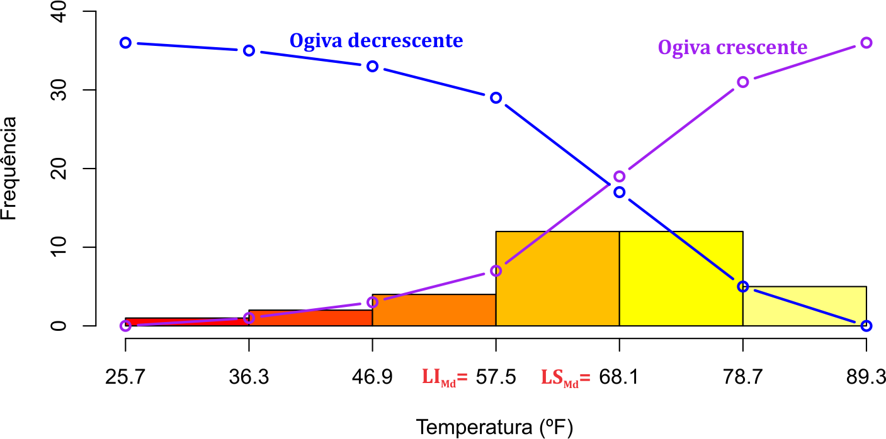
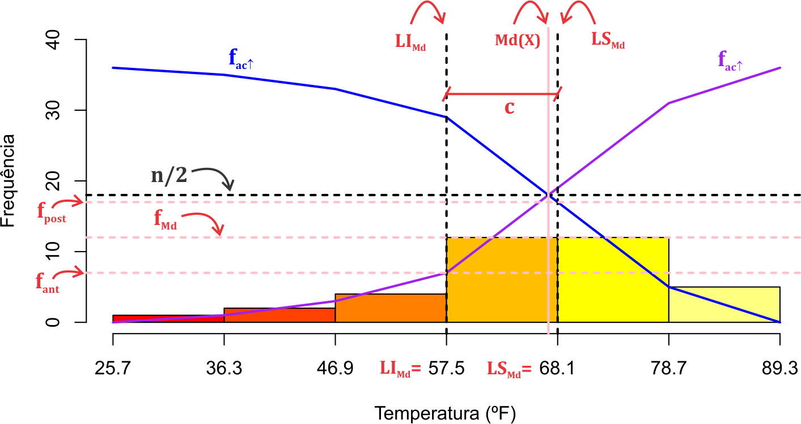
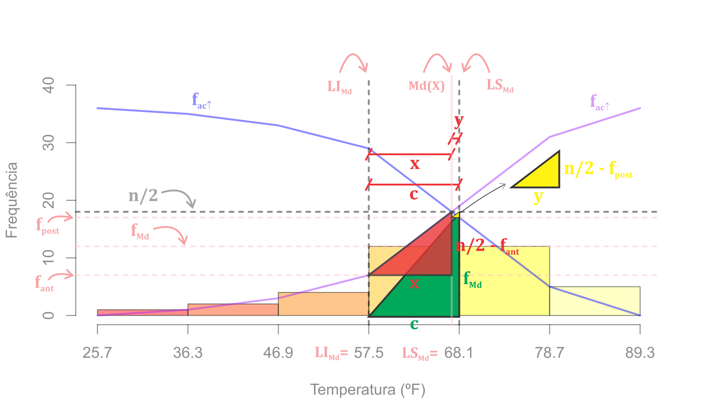
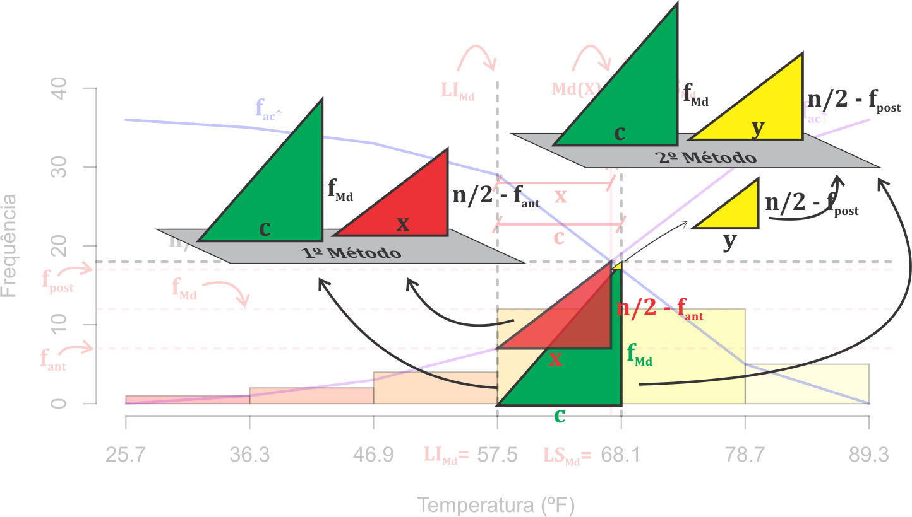
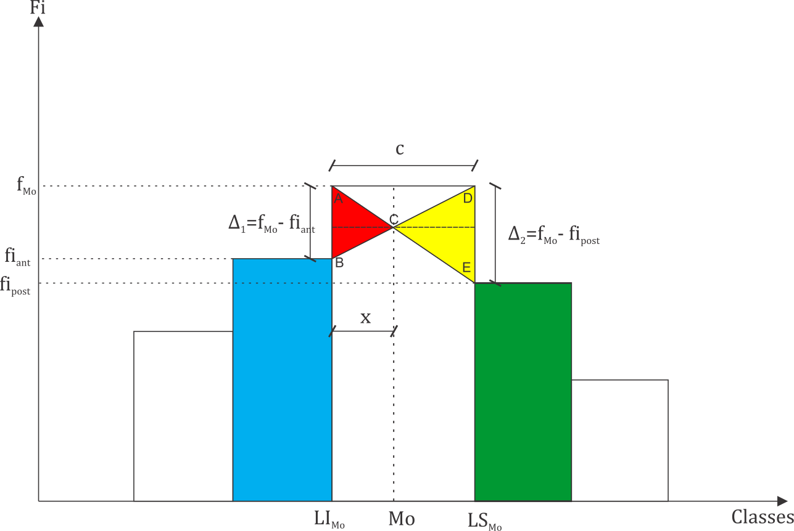

# Medidas de posição {#mp}

## Introdução

Após tabularmos os dados ou apresentarmos graficamente, percebemos que ainda assim a quantidade de informações pode ser muito grande para descrevê-los. Desse modo, surgem algumas medidas que podem resumir tudo isso, de modo a preservar as principais características contidas nessas observações, são as denominadas medidas de posição ou tendência central, e as medidas de dispersão ou de variabilidade, que tem a propriedade de localizar a distribuição dos dados e também caracterizar sua variabilidade, respectivamente. Nesse capítulo trataremos das medidas de posição, e no Capítulo \@ref(chap:md), as medidas de dispersão.

As medidas de posição medidas de posição representam o ponto central da massa de dados, de modo que o seu valor indica que as observações estão em torno dele, mas que não necessariamente, o valor dessa medida central exista no conjunto de dados. A escolha das medidas de posição apresentadas, dependerá da natureza das variáveis, bem como algumas peculiaridades existentes nos dados, como por exemplo, a existência de dados discrepantes. Vamos apresentar na sequência, a primeira medida de tendência central e a mais conhecida e utilizada na estatística, a média aritmética.

## Média 

Quando iniciamos uma conversa e percebemos que alguém está no meio termo em um determinado posicionamento, dizemos que a pessoa está fazendo "média", vulgarmente, dizemos que está em cima do muro. Nesse mesmo raciocínio, é a média aritmética, uma medida em que o seu valor representa o valor central das observações. Podemos comparar a média como um ponto de equilíbrio em um sistema de pesos, do qual se cada observação pode ser representada com uma certa massa no ponto no eixo X de um plano cartesiano, então o ponto que representa a média equilibrará esse sistema de pesos. Definimos,

<div id="def:medart" class="definicao" cap=3 titulo="(Média aritmética)">
Seja uma amostra $X_1$, $X_2$, \ldots, $X_n$, de uma população $X_1$, $X_2$, \ldots, $X_N$, de tamanhos $n$ e $N$, respectivamente, definimos a média aritmética por:
\begin{align}
    \mu & = \frac{\displaystyle\sum_{i=1}^{N}X_i}{N}, \quad \textrm{(População)} (\#eq:medaritpop)
\end{align}
  e
\begin{align}
    \bar{X} = \frac{\displaystyle\sum_{i=1}^{n}X_i}{n}. \quad \textrm{(Amostra)} (\#eq:media)
\end{align}
</div>

Em notação, dizemos que $\mu$ é uma característica amostral, isto é, representa a média populacional e chamamos de parâmetro. Na prática, essa informação é desconhecida e a representamos por uma medida amostral, que chamamos de estimador, uma função que depende apenas dos dados amostrais. Um estimador para $\mu$ representa a média aritmética $\bar{X}$. O valor observado de $\bar{X}$ pode ser representado por $\bar{x}$, em termos de notação. Vejamos um exemplo a seguir.

<div id="exem:exemmedamost" class="exemplo" cap=3 titulo=" ">
Considerando os dados da Tabela \@ref(tab:erroscanal), podemos calcular a média amostral da seguinte forma:

\begin{align*}
  \bar{X} =  \frac{3 + 1 + \ldots + 1}{20}=\frac{34}{20}= 1,7~\textrm{erros}.
\end{align*}

Portanto, o número de erros encontrados em um conjunto de caracteres, podem ser representados por uma única medida, que é a média amostral. A interpretação é que, em média, ocorreram $1,7$ erros nos caracteres monitorados em um meio de comunicação, e significa, que os 20 conjuntos de caracteres apresentam um número de erros em torno desse valor.
</div>

A Definição [3.1](#def:medart) é utilizada para dados sem agrupamento, isto é, dados brutos ou dados elaborados. Para o caso de dados agrupados em distribuição de frequência, definimos,

<div id="def:medaritagrupado" class="definicao" cap=3 titulo="(Média aritmética em dados agrupados)">
Seja uma amostra $X_1$, $X_2$, \ldots, $X_n$, de tamanho $n$, agrupados em $k$ grupos com variáveis $X_i$ e frequência $F_i$, ou $k$ classes com pontos médios $\tilde{X}_i$ e $F_i$ frequências, para $i$ $=$ $1$, $2$, $\ldots$, $k$ e $\sum_{i = 1}^{k}F_i = n$, então a média aritmética de uma amostra, é definida por:
  \begin{align}
    \bar{X} & = \left\{\begin{array}{ll}
                   \frac{\sum_{i = 1}^{k}X_i \times F_i}{\sum_{i = 1}^{k}F_i}, &  \textrm{agrupados sem intervalo de classe}, \\
                   &\\
                   \frac{\sum_{i = 1}^{k}\tilde{X}_i \times F_i}{\sum_{i = 1}^{k}F_i}, &  \textrm{agrupados com intervalo de classe},\\
                 \end{array}\right. (\#eq:mediaagrup)
  \end{align}
  sendo $\tilde{X}_{i}$ o ponto médio das classes.
</div>

Podemos representar a Definição [3.2](#def:medaritagrupado) em termos populacionais, substituindo o tamanho $n$ por $N$, como também representar a expressão em termos de valor observado. Porém, em termos de notação, preferimos usar dessa forma. Vejamos mais um exemplo a seguir.

<div id="" class="exemplo" cap=3 titulo=" ">
\begin{align*}
  \bar{X} = \frac{0 \times 3 + 1 \times 7 + \ldots + 4 \times 1}{20}=\frac{34}{20}=1,7~\textrm{erros}.
\end{align*}
Notamos que o resultado para a média amostral é o mesmo obtido no Exemplo \ref{exemmedamost}, porque mesmo agrupando os dados, o cálculo da média para esse tipo de dado, se baseia nos próprios valores observados.
</div>

Porém, para o caso da variáveis quantitativas contínuas isso não ocorre, porque usamos o ponto médio para representar as observações de cada classe. Vejamos o próximo exemplo, a seguir.

<div id="" class="exemplo" cap=3 titulo=" ">
Consideremos agora os dados agrupados do Exemplo [2.1](#exem:Challanger1986). Trata-se de uma variável quantitativa contínua e, portanto, a média é baseada de acordo com a expressão \@ref(eq:mediaagrup), para o caso de dados agrupados com intervalo de classe, que segue:
\begin{equation}\label{mediacontinua}
  \bar{X}=\displaystyle\sum_{i=1}^{k}\frac{\tilde{X}_iF_i}{\sum_{i=1}^{k}F_i}= \frac{31 \times 1 + 41,60 \times 2 + \ldots + 84,00 \times 5}{1+2+\ldots+5} = 66,04^oF.
\end{equation}
Se calculássemos a média sem agrupamento, o valor seria $\bar{X} = 65,86$ºF. Observamos uma perda de precisão com os dados quando agrupados com intervalo de classe. Mas isso pode ser justificado por exemplo, se nesse experimento a diferença em $0,18$ºF não altera os resultados da pesquisa, e assim, podemos apresentar os dados de forma mais organizada.
</div>

Nos exemplos anteriores, observamos que a média leva em consideração a todas as observações, em seu cálculo. Apesar dessa ideia ser interessante, uma vez que conseguimos captar as informações de cada elemento da amostra ou população, qualquer alteração que houver em alguma observação, pode alterar completamente o resultado da média aritmética. É caso dos dados discrepantes, isto é, observações muito distante da grande parte dos dados. Isso pode ocorrer por diversas situações, como erro humano, ao digitar errado em uma planilha, elementos mal amostrados, de modo que, determinado elemento selecionado para a amostra não pertencia a população de interesse, ou até mesmo, uma condição atípica na realização da coleta dos dados. Vejamos mais algumas características da média aritmética:

  - a unidade da média está na mesma escala da variável em estudo;
  - a média é uma das medidas mais conhecidas e utilizadas, devido as suas propriedades estatísticas que serão vistas nos capítulos seguintes;
  - é única para cada conjunto de dados;
  - usada apenas para variáveis quantitativas;
  - não pode ser calculada para dados agrupados que apresentam classes extremas abertas;
  - é influenciada por dados discrepantes.

Uma saída para contornar o problema dos dados discrepantes, pode ser abordado no exemplo a seguir.

<div id="exem:mediaaparado" class="exemplo" cap=3 titulo=" ">
Considere um conjunto de dados ($n=17$) fictícios que apresentam a maior e a menor observação como suspeitos de serem atípicos quanto as suas ocorrências:
$$1, 5, 5, 6, 7, 7, 7, 8, 8, 8, 8, 8, 9, 9, 10, 10, 40$$

Para representar esse conjunto de dados,  usamos a média aritmética para representá-los:

\begin{align*}
  \bar{X} & = \frac{1 + 5 + \ldots + 40}{17} = 9,67~und.
\end{align*}

Observamos que as observações $x_1 = 1~unid.$ e $x_{17} = 40~und.$ podem ter influenciado o resultado, e como suspeitamos desses valores, vamos usar uma medida mais robusta a essa violação, isto é, que não será influenciado por esses valores. Chamamos de média aparada, denotada por $\bar{X}_{ap}$, que para uma amostra de tamanho $n$, temos:
\begin{align}
  \bar{X}_{ap} & = \displaystyle\frac{\sum_{i = 2}^{n - 1}X_{(i)}}{n - 2}, (\#eq:medaparada)
\end{align}
em que $X_{(i)}$ é a $(i)$-ésima variável em ordem crescente de magnitude, tal que $X_{(1)} = \min\limits_{i}X_i$ e $X_{(n)} = \max\limits_{i}X_i$.

Usando a expressão \@ref(eq:medaparada), apresentamos a média aparada:
$$
\bar{X}_{ap}=\frac{5 + 5 + \ldots + 10}{15} = 7,65~unid.
$$

Observamos pelo resultado, que os valores extremos acabam não influenciando no resultado da média aparada, e portanto, pode ser uma alternativa de medida de posição, para representar o conjunto de dados.
</div>

Complementando as características da média, apresentamos algumas propriedades pelo Teorema [3.1](#teo:mediaaritm) a seguir, do qual iremos usar a Definição [3.1](#def:medarit) como base, e as demais seguem de forma similar.

<div id="teo:mediaaritm" class="teorema" cap=3 titulo="Propriedades de somatório">
Baseado na Definição \ref{def:medarit}, e considerando $c$ uma constante, então:

I) Se para uma amostra $X_1$, $X_2$, \ldots, $X_n$, a média aritmética é dada por $\bar{X} = \frac{\sum_{i=1}^{n}X_i}{n}$, então para uma transformação de $Y_i = X_i \pm c$, para $i$ $=$ $1$, $2$, \ldots, $n$, a nova média aritmética é dada por $\bar{Y} = \bar{X} \pm c$;
II) Se para uma amostra $X_1$, $X_2$, \ldots, $X_n$, a média aritmética é dada por $\bar{X} = \frac{\sum_{i=1}^{n}X_i}{n}$, então para uma transformação de $Y_i = X_i \times c$, para $i$ $=$ $1$, $2$, \ldots, $n$, a nova média aritmética é dada por $\bar{Y} = \bar{X} \times c$. Esse resultado vale também para a transformação $Y_i = X_i / m$, sendo $m$ também uma constante. Basta usar $c = 1 / m$ e o resultado é o mesmo.
III) A soma de quadrado de desvios dos dados em relação a uma constante $c$, é minimizada se $c = \bar{X}$.
</div>

<div id="prova:mediaaritm" class="prova" cap=3 titulo="">
I) Considerando uma amostra $X_1$, $X_2$, \ldots, $X_n$, e $c$ uma constante, e que $Y_i = X_i \pm c$, para $i$ $=$ $1$, $2$, $\ldots$, $n$, então a média aritmética de $Y_i$ é dado por:
  \begin{align*}
    \bar{Y} & = \frac{\sum_{i=1}^{n}Y_i}{n}\\
            & = \frac{\sum_{i=1}^{n}X_i \pm c}{n}\\
            & = \frac{\sum_{i=1}^{n}X_i}{n} \pm \frac{\sum_{i=1}^{n} c}{n}\\
            & = \frac{\sum_{i=1}^{n}X_i}{n} \pm \frac{n \times c}{n}\\
            & = \bar{X} \pm c. \quad \textrm{c.q.d.}
  \end{align*}
II) Considerando uma amostra $X_1$, $X_2$, \ldots, $X_n$, e $c$ uma constante, e que $Y_i = X_i \times c$, para $i$ $=$ $1$, $2$, $\ldots$, $n$, então a amplitude de $Y_i$ é dado por:
  \begin{align*}
    \bar{Y} & = \frac{\sum_{i=1}^{n}Y_i}{n}\\
            & = \frac{\sum_{i=1}^{n}X_i \times c}{n}\\
            & = \frac{X_1 \times c + X_2 \times c + \ldots + X_n \times c}{n} \\
            & = c \times \frac{X_1 + X_2 + \ldots + X_n }{n} \\
            & = c \times \bar{X}. \quad \textrm{c.q.d.}
  \end{align*}
III) Fazendo:

$$
D=\sum\limits_{i=1}^{n}(X_i-c)^2.
$$
Expandindo o somatório e derivando $D$ em relação a ``c", temos que

$$
D=\sum\limits_{i=1}^{n}(X_i-c)^2=\sum\limits_{i=1}^{n}(X_i^2-2cX_i+c^2)=\sum\limits_{i=1}^{n}X_i^2-\sum\limits_{i=1}^{n}2cX_i+\sum\limits_{i=1}^{n}c^2,
$$
e que
$$
\frac{dD}{dc}=-2\sum\limits_{i=1}^{n}X_i+2nc.
$$

Igualando a derivada a zero, e resolvendo em $A$, temos:
$$
\frac{dD}{dc}=-2\sum\limits_{i=1}^{n}X_i+2nc=0,
$$
$$
2nc=2\sum\limits_{i=1}^{n}X_i,
$$
$$
c=\frac{\sum\limits_{i=1}^{n}X_i}{n} = \bar{X}.
$$
Certificando se o ponto é de máximo ou de mínimo,
$$
\frac{d^2D}{d^2c}=2n>0.
$$
Como a segunda derivada é maior que zero, fica provado que o ponto é de mínimo.
</div>

## Mediana 

Uma outra alternativa para contornarmos os problemas de dados discrepantes encontrados na média aritmética, pode ser apresentada por meio da medida de posição chamada de mediana, do qual leva em consideração a posição ordenada dos dados ao invés de usar or próprios valores observados. Mas especificamente, o valor da mediana é o ponto central dos dados, em que abaixo desse valor, representa as 50\% menores observação, ao passo que, os valores acima da mediana representam as 50\% maiores observações. De outro modo, dizemos que a mediana representa um ponto central no conjunto de dados em que a quantidade de elementos abaixo ou acima desse valor, não supera 50\%. Essa última definição representa melhor o que significa a mediana, pois podemos ter valores centrais repetidos, e dessa forma isso ocorrendo, a primeira afirmação não será válida para a definição da mediana. Formalmente, definimos,

<div id="def:mediana" class="definicao" cap=3 titulo="(Mediana)">
Seja uma amostra $X_1$, $X_2$, \ldots, $X_n$, de uma população $X_1$, $X_2$, \ldots, $X_N$, de tamanhos $n$ e $N$, respectivamente, definimos a mediana por:
  \begin{align}
    \mu_d(X) & = \left\{\begin{array}{ll}
      \frac{X_{(\frac{N}{2})} + X_{\left( \frac{N}{2} + 1
          \right)}}{2}, & \textrm{se } N  \textrm{ for um número par} \\
          & \\
      X_{(\frac{N + 1}{2})}, & \textrm{se } N  \textrm{ for um número ímpar} \\
    \end{array}\right., \quad \textrm{(População)} (\#eq:medianapop)
  \end{align}
  sendo $\mu_d(X)$ a mediana populacional e que $X_{(i)}$ é a $(i)$-ésima variável em ordem crescente de magnitude, tal que $X_{(1)} = \min\limits_{i}X_i$ e $X_{(n)} = \max\limits_{i}X_i$. De modo similar,
  \begin{align}
    Md(X) & = \left\{\begin{array}{ll}
      \frac{X_{(\frac{n}{2})} + X_{\left( \frac{n}{2} + 1
          \right)}}{2}, & \textrm{se } n  \textrm{ for um número par} \\
          & \\
      X_{(\frac{n + 1}{2})}, & \textrm{se } n  \textrm{ for um número ímpar} \\
    \end{array}\right., \quad \textrm{(Amostra)} (\#eq:medianaamost)
  \end{align}
  sendo $Md(X)$ a mediana amostral e que $X_{(i)}$ é a $(i)$-ésima variável em ordem crescente de magnitude, tal que $X_{(1)} = \min\limits_{i}X_i$ e $X_{(n)} = \max\limits_{i}X_i$.
</div>


  
A mediana amostral é o melhor estimador para a mediana populacional, e pode ser considerado também como um estimador para a média populacional ($\mu$). Detalhes sobre a escolha de um melhor estimador para um determinado parâmetro, será estudado no Capítulo \@ref(chap:teoest). Como a mediana leva em consideração a posição das observações, a condição do tamanho amostral ou populacional acaba sendo importante para essa medida, de modo que, se o tamanho for um número par ou ímpar, teremos condições diferentes para o cálculo. Uma outra informação importante para o cálculo da mediana, é que será necessário ordenar as observações de modo crescente. Em notação para o caso de uma amostra de tamanho $n$, dizemos que $X_{(1)}$, $X_{(2)}$, $\ldots$, $X_{(n)}$ representa uma amostra em ordem crescente de magnitude, isto é, $X_{(1)} = \min_{i}X_i$ e $X_{(n)} = \max_{i}X_i$, e precisaremos desse ordenamento para obter o valor da mediana, baseados na expressões da Definição [3.3](#def:mediana). Se utilizarmos o Exemplo [3.4](#exem:mediaaparado), perceberemos que não é necessário eliminar as observações extremas em ordem de magnitude, como foi realizado com a média aparada. Isso demonstra que a mediana é uma outra alternativa de medida robusta para a escolha de uma medida de posição de modo a representar um conjunto de dados. Vejamos o exemplo a seguir.

<div id="" class="exemplo" cap=3 titulo="">
  Considerando o Exemplo [3.4](#exem:mediaaparado), como $n = 17$ é ímpar, a mediana amostral desse conjunto de dados fictícios é dado por:
    \begin{align*}
      Md(X) & = X_{(\frac{17 + 1}{2})} = X_{(9)} = 8~unid.
    \end{align*}
  Esse valor representa uma medida central do qual os 50\% menores valores dos dados estão abaixo de $8~unid.$, e que os 50\% maiores valores dos dados estão acima de $8~unid.$. Porém, percebemos que os valores $x_{(1)} = 1$ e $x_{(17)} = 40$ não influenciaram nesse resultado. Isso mostra, a robustez da mediana quanto a esse aspecto.
</div>

Para o caso de variáveis quantitativas contínuas sem agrupamento, o procedimento é o mesmo realizado no Exemplo [3.6](#exem:exemmedsagrup). Para os dados da Tabela \@ref(tab:erroscanaldf), isto é, dados agrupados sem intervalo de classe (variáveis quantitativas discretas), podemos calcular a mediana usando a Definição [3.3](#def:mediana). Precisaremos apenas complementar as informações com o acréscimo da frequência acumulada *abaixo de* ($f_{ac\downarrow_i}$), que foi apresentada na Tabela \@ref(tab:erroscanalacum). Vejamos o próximo exemplo.

<div id="exem:exemmedsagrup" class="exemplo" cap=3 titulo="">
 Vejamos os dados do número de erros de caracteres em 20 conjuntos, descritos na Tabela \@ref(tab:erroscanalacum), em que simplificamos os resultados, que segue:

<style type="text/css">
.tg  {border-collapse:collapse;border-color:#93a1a1;border-spacing:0;}
.tg td{background-color:#fdf6e3;border-bottom-width:1px;border-color:#93a1a1;border-style:solid;border-top-width:1px;
  border-width:0px;color:#002b36;font-family:Arial, sans-serif;font-size:14px;overflow:hidden;padding:10px 5px;
  word-break:normal;}
.tg th{background-color:#657b83;border-bottom-width:1px;border-color:#93a1a1;border-style:solid;border-top-width:1px;
  border-width:0px;color:#fdf6e3;font-family:Arial, sans-serif;font-size:14px;font-weight:normal;overflow:hidden;
  padding:10px 5px;word-break:normal;}
.tg .tg-ezbu{background-color:#eee8d5;border-color:inherit;text-align:center;vertical-align:top}
.tg .tg-c3ow{border-color:inherit;text-align:center;vertical-align:top}
<style type="text/css">
.tg  {border-collapse:collapse;border-color:#93a1a1;border-spacing:0;}
.tg td{background-color:#fdf6e3;border-bottom-width:1px;border-color:#93a1a1;border-style:solid;border-top-width:1px;
  border-width:0px;color:#002b36;font-family:Arial, sans-serif;font-size:14px;overflow:hidden;padding:10px 5px;
  word-break:normal;}
.tg th{background-color:#657b83;border-bottom-width:1px;border-color:#93a1a1;border-style:solid;border-top-width:1px;
  border-width:0px;color:#fdf6e3;font-family:Arial, sans-serif;font-size:14px;font-weight:normal;overflow:hidden;
  padding:10px 5px;word-break:normal;}
.tg .tg-c3ow{border-color:inherit;text-align:center;vertical-align:top}
</style>
<table class="tg">
<thead>
  <tr>
    <th class="tg-c3ow">Número de erros ($X_i$)</th>
    <th class="tg-c3ow">$F_i$</th>
    <th class="tg-c3ow">Frequência acumulada ($F_{ac\downarrow_i}$)</th>
  </tr>
</thead>
<tbody>
  <tr>
    <td class="tg-c3ow">0</td>
    <td class="tg-c3ow">3</td>
    <td class="tg-c3ow">3</td>
  </tr>
  <tr>
    <td class="tg-c3ow">1</td>
    <td class="tg-c3ow">7</td>
    <td class="tg-c3ow">10</td>
  </tr>
  <tr>
    <td class="tg-c3ow">2</td>
    <td class="tg-c3ow">4</td>
    <td class="tg-c3ow">14</td>
  </tr>
  <tr>
    <td class="tg-c3ow">3</td>
    <td class="tg-c3ow">5</td>
    <td class="tg-c3ow">19</td>
  </tr>
  <tr>
    <td class="tg-c3ow">4</td>
    <td class="tg-c3ow">1</td>
    <td class="tg-c3ow">20</td>
  </tr>
  <tr>
    <td class="tg-c3ow">Total</td>
    <td class="tg-c3ow">20</td>
    <td class="tg-c3ow">-</td>
  </tr>
</tbody>
</table>
  O valor da mediana será dado da seguinte forma:
  \begin{align*}
    Md(X) & = \frac{X_{(\frac{20}{2})} + X_{\left( \frac{20}{2} + 1
          \right)}}{2}\\
          & = \frac{X_{(10)} + X_{(11)}}{2}.
  \end{align*}
  Para sabermos qual o valor observado para a variável $X_{(10)}$ e $X_{(11)}$, marcamos os grupos 2 (linhas 2 de vermelho) e 3 (linha 3 de amarelo). No grupo 2, temos sete elementos que correspondem as variáveis $X_{(4)}$, $X_{(5)}$, $\ldots$, $X_{(10)}$, uma vez que os três menores valores estão no grupo 1. Assim o $X_{(10)} = 1$ erros. No grupo 3, nós temos quatro elementos que correspondem as variáveis $X_{(11)}$, $X_{(12)}$, $\ldots$, $X_{(14)}$, uma vez que abaixo desse grupo nós temos as dez primeiras observações. Assim, o $X_{(11)} = 2$ erros. Usamos as frequências simples ($F_i$) e acumulada $F_{ac\downarrow_i}$, para obter essas informações. Retornando ao cálculo da mediana, temos:
  \begin{align*}
    Md(X) & = \frac{X_{(10)} + X_{(11)}}{2}\\
          & = \frac{1 + 2}{2} = 1,5~\textrm{erros}.
  \end{align*}
  Caso os dados estivessem em rol, o resultado seria o mesmo.
</div>

No caso de dados agrupados com intervalo de classe (variáveis quantitativas contínuas), vamos definir um estimador para a mediana populacional, usando uma dedução geométrica por meio do histograma de frequências e as ogivas. Para isso, vamos usar os dados do Exemplo [2.1](#exem:Challanger1986) para facilitar a explicação, em que apresentamos na Figura \@ref(fig:mediana1) o histograma e as ogivas desses dados agrupados.

```{r mediana1, echo=FALSE, fig.align='center', fig.cap='Histograma de frequência e ogivas para a dedução do cálculo da mediana.', out.width='90%'}

```

Para estimar a mediana a partir dos dados arranjados em uma tabela de distribuição de frequência com intervalo de classe, é necessário definir a classe mediana  e em seguida encontrar a mediana interpolando os resultados. A posição da mediana é obtida acumulando-se  frequências das classes 1, 2, etc., até se encontrar o valor que seja igual ou imediatamente superior a $n/2$. Apresentamos algumas notações importantes para o entendimento da dedução do estimador de $\mu_d(X)$, que segue:

- $LI_{Md}$: Limite inferior da classe da mediana;
- $LS_{Md}$: Limite superior da classe da mediana;
- $f_{Md}$: Frequência absoluta da classe da Mediana;
- $f_{ant}$: Frequência acumulada (abaixo de) anterior à classe da Mediana;
- $f_{post}$: Frequência acumulada
(acima de) posterior à classe da Mediana;
- $c$: Amplitude da classe da Mediana.

Com essa notação apresentamos a Figura \@ref(fig:mediana2) para facilitar a compreensão da dedução. Iremos apresentar dois métodos, o primeiro baseado no limite inferior da classe da mediana, e o segundo baseado no limite superior da classe da mediana. Nesse tipo de natureza de dados, desprezaremos se o número de elementos é par ou ímpar. Entenderemos que a classe da mediana é aquela que contempla o valor observado para a variável $X_{(n / 2)}$. Para isso, podemos observar esse valor na coluna da frequência acumulada (*abaixo de*), $f_{ac\downarrow_i}$. Nos dados do Exemplo [2.1](#exem:Challanger1986), a classe da mediana é $57,5$ $|$--- $68,1$ porque $f_{ac\downarrow_4} = 19$, isto é, abaixo de $68,1~\textrm{ºF}$ temos as primeiras $19$ observações, e nessa classe contemplamos as observações ordenadas $x_{(8)}$, $x_{(9)}$, $\ldots$, $x_{(19)}$, que contém $x_{(n / 2)} = x_{(36 / 2)} = x_{(19)}$. Temos essas observações na classe 4 (classe da mediana), porque a frequência acumulada (*abaixo de*) anterior a classe da mediana, $f_{ac\downarrow_3} = 7$. Isso significa que a partir do oitavo elemento ordenado até o décimo nono temos elementos pertencentes a classe da mediana.

Feito essas considerações, apresentamos o primeiro método de dedução da expressão da mediana, a seguir.

```{r mediana2, echo=FALSE, fig.align='center', fig.cap='Histograma de frequência e ogivas para a dedução do cálculo da mediana com as notações.', out.width='90%'}

```

**1º Método**

Uma vez que sabemos a classe da mediana, pela Figura \@ref(fig:mediana3) podemos determinar o valor da mediana por:

```{r mediana3, echo=FALSE, fig.align='center', fig.cap='Detalhamento do Histograma de frequência e ogivas para a dedução do cálculo da mediana com as notações.', out.width='90%'}

```

\begin{align}
  Md(X) & = LI_{Md} + x, (\#eq:mediana3)
\end{align}

sendo necessário encontrar o valor $x$. Assim, faremos uma regra de três simples pela semelhança de triângulos (triângulo verde e vermelho) que pode ser observado pela Figura \@ref(fig:mediana4).

```{r mediana4, echo=FALSE, fig.align='center', fig.cap='Semelhança de triângulos para a dedução do cálculo da mediana com as notações.', out.width='90%'}

```

Assim, temos

<style type="text/css">
.tg  {border-collapse:collapse;border-spacing:0;}
.tg td{border-bottom-width:1px;border-color:black;border-style:solid;border-top-width:1px;border-width:0px;
  font-family:Arial, sans-serif;font-size:14px;overflow:hidden;padding:10px 5px;word-break:normal;}
.tg th{border-bottom-width:1px;border-color:black;border-style:solid;border-top-width:1px;border-width:0px;
  font-family:Arial, sans-serif;font-size:14px;font-weight:normal;overflow:hidden;padding:10px 5px;word-break:normal;}
.tg .tg-sh4c{text-align:center;vertical-align:top}
.tg .tg-baqh{text-align:center;vertical-align:top}
</style>
<table class="tg">
<thead>
  <tr>
    <th class="tg-baqh">Variação</th>
    <th class="tg-baqh" colspan="2">Frequência</th>
  </tr>
</thead>
<tbody>
  <tr>
    <td class="tg-sh4c">$c$</td>
    <td class="tg-sh4c">$\rightarrow$</td>
    <td class="tg-sh4c">$f_{Md}$</td>
  </tr>
  <tr>
    <td class="tg-baqh">$x$</td>
    <td class="tg-baqh">$\rightarrow$</td>
    <td class="tg-baqh">$n/2-f_{ant}$</td>
  </tr>
</tbody>
</table>

Determinando $x$,
$$
x=\left\lbrace \frac{\frac{n}{2}-f_{ant}}{f_{Md}}\right\rbrace c.
$$

Como $Md(X) = LI_{Md} + x$, então

\begin{equation}
Md(X) = LI_{Md} + \left\lbrace \frac{\frac{n}{2}-f_{ant}}{f_{Md}}\right\rbrace \times c. (\#eq:mediana)
\end{equation}

**2º Método**

Uma vez que sabemos a classe da mediana, pela Figura \@ref(fig:mediana3) podemos determinar o valor da mediana pelo segundo método, sendo necessário encontrar o valor $y$ na seguinte expressão \@ref(eq:mediana4).

\begin{align}
  Md(X) & = LS_{Md} - y. (\#eq:mediana4)
\end{align}

Assim, faremos uma regra de três simples usando a semelhança de triângulos (triângulo verde e amarelo). Assim,

<style type="text/css">
.tg  {border-collapse:collapse;border-spacing:0;}
.tg td{border-bottom-width:1px;border-color:black;border-style:solid;border-top-width:1px;border-width:0px;
  font-family:Arial, sans-serif;font-size:14px;overflow:hidden;padding:10px 5px;word-break:normal;}
.tg th{border-bottom-width:1px;border-color:black;border-style:solid;border-top-width:1px;border-width:0px;
  font-family:Arial, sans-serif;font-size:14px;font-weight:normal;overflow:hidden;padding:10px 5px;word-break:normal;}
.tg .tg-sh4c{text-align:center;vertical-align:top}
.tg .tg-baqh{text-align:center;vertical-align:top}
</style>
<table class="tg">
<thead>
  <tr>
    <th class="tg-baqh">Variação</th>
    <th class="tg-baqh" colspan="2">Frequência</th>
  </tr>
</thead>
<tbody>
  <tr>
    <td class="tg-sh4c">$c$</td>
    <td class="tg-sh4c">$\rightarrow$</td>
    <td class="tg-sh4c">$f_{Md}$</td>
  </tr>
  <tr>
    <td class="tg-baqh">$y$</td>
    <td class="tg-baqh">$\rightarrow$</td>
    <td class="tg-baqh">$n/2-f_{post}$</td>
  </tr>
</tbody>
</table>

Determinando $y$,

$$
y=\left\lbrace \frac{\frac{n}{2}-f_{post}}{f_{Md}}\right\rbrace c.
$$
a mediana amostral pode ser expressa como

\begin{equation}
Md(X) = LS_{Md} - \left\lbrace \frac{\frac{n}{2}-f_{post}}{f_{Md}} \right\rbrace \times c.
\end{equation}


Formalizando essas ideias, definimos um estimador da mediana amostral para dados agrupados com intervalo de classe da seguinte forma,

<div id="def:medianadadclasse" class="definicao" cap=3 titulo="(Mediana em dados agrupados com intervalo de classe)">
Seja uma amostra $X_{(1)}$, $X_{(2)}$, \ldots, $X_{(n)}$ em ordem crescente de magnitude, de tamanho $n$, agrupados em $k$ classes com pontos médios $\tilde{X}_i$ e $F_i$ frequências, para $i$ $=$ $1$, $2$, $\ldots$, $k$ e $\sum_{i = 1}^{k}F_i = n$, então a mediana amostral é definida por:
  \begin{align}
    Md(X) = LI_{Md} + \left\lbrace \frac{\frac{n}{2}-f_{ant}}{f_{Md}}\right\rbrace \times c. (\#eq:medianadadclasse1)
  \end{align}
  em que $LI_{Md}$ é o limite inferior da classe da mediana, $f_{ant}$ é a frequência acumulada (*abaixo de*) anterior a classe da mediana, $f_{Md}$ frequência absoluta da classe da mediana, $c$ a amplitude da classe da mediana, ou de forma similar,
  \begin{align}
    Md(X) = LS_{Md} - \left\lbrace \frac{\frac{n}{2}-f_{post}}{f_{Md}} \right\rbrace \times c. (\#eq:medianadadclasse2)
  \end{align}
  em que $LS_{Md}$ é o limite superior da classe da mediana e $f_{post}$ é a frequência acumulada (*acima de*) posterior a classe da mediana.
</div>

Vamos apresentar o resultado da mediana para os dados do Exemplo [2.1](#exem:Challanger1986) a seguir.

<div id="" class="exemplo" cap=3 titulo="">
Retornando aos dados do Exemplo [2.1](#exem:Challanger1986), vamos calcular a mediana pelos dois métodos, do qual temos o primeiro resultado, usando a expressão \@ref(eq:medianadadclasse1),
\begin{align*}
  Md(X) & = 57,5 + \left\{ \frac{18 - 7}{12}\right\} \times 10,6 = 67,22~\textrm{ºF}.
\end{align*}
Usando o segundo método, expressão \@ref(eq:medianadadclasse2), temos,
\begin{align*}
  Md(X) & = 68,1 - \left\{ \frac{18 - 17}{12}\right\} \times 10,6 = 67,22~\textrm{ºF}.
\end{align*}
Os resultados são equivalentes como era de se esperar.
</div>

Vejamos algumas características sobre a mediana, que seguem:

- A mediana não é influenciada por valores extremos;
- Uma medida que pode ser obtida em distribuições de frequências que apresentam classe com limites indefinidos;
- o resultado da mediana é obtida na mesma escala da variavel em estudo;
- a mediana é menos informativa que a média, por não levar em consideração os valores observados, mas as posições dessas observações;
- a mediana pode ser calculada em variáveis qualitativas ordinais, cuja média não pode ser obtida;
- a mediana ainda pode ser obtida em um conjunto de dados em que alguns valores ainda não foram registrados, caso em que a média não pode ser obtida.

Para complementarmos essas características, vamos apresentar algumas propriedades da mediana no Teorema [3.2](#teo:propmediana). Iremos a Definição [3.3](#def:mediana), bem como a expressão \@ref(eq:medianaamost) para $n$ ímpar. Para os demais casos, os resultados são similares.

<div id="teo:propmediana" class="teorema" cap=3 titulo="Propriedades da mediana">
Baseado na Definição [3.3](#def:mediana), e considerando $c$ uma constante, então:

I) Se para uma amostra $X_{(1)}$, $X_{(2)}$, \ldots, $X_{(n)}$ em ordem crescente de magnitude, a mediana é dada por $Md{X} = X_{(\frac{n + 1}{2})}$, então para uma transformação de $Y_i = X_i \pm c$, para $i$ $=$ $1$, $2$, $\ldots$, $n$, a mediana aritmética é dada por $Md(Y) = Md(X) \pm c$;
II) Se para uma amostra $X_{(1)}$, $X_{(2)}$, \ldots, $X_{(n)}$ em ordem crescente de magnitude, a mediana é dada por $Md{X} = X_{(\frac{n + 1}{2})}$, então para uma transformação de $Y_i = X_i \pm c$, para $i$ $=$ $1$, $2$, $\ldots$, $n$, a nova mediana é dada por $Md{Y} = Md{X} \times c$. Esse resultado vale também para a transformação $Y_i = X_i / m$, sendo $m$ também uma constante. Basta usar $c = 1 / m$ e o resultado é o mesmo.
III) A soma do módulo dos desvios dos dados em relação a uma constante arbitrária $c$, terá um valor mínimo se $c=Md(X)$.
</div>

<div id="prova:propmediana" class="prova" cap=1 titulo="">
I) Considerando uma amostra $X_1$, $X_2$, \ldots, $X_n$, e $c$ uma constante, e que $Y_i = X_i \pm c$, para $i$ $=$ $1$, $2$, $\ldots$, $n$, então a mediana de $Y_i$ é dado por:
    \begin{align*}
      Md(Y) & =  Y_{(\frac{n + 1}{2})}\\
          & =  X_{(\frac{n + 1}{2})} \pm c\\
          & = Md(X) \pm c. \quad \textrm{c.q.d.}
    \end{align*}
II) Considerando uma amostra $X_1$, $X_2$, \ldots, $X_n$, e $c$ uma constante, e que $Y_i = X_i \times c$, para $i$ $=$ $1$, $2$, $\ldots$, $n$, então a mediana de $Y_i$ é dado por:
    \begin{align*}
      Md(Y) & =  Y_{(\frac{n + 1}{2})}\\
          & =  X_{(\frac{n + 1}{2})} \times c\\
          & = Md(X) \times c. \quad \textrm{c.q.d.}
    \end{align*}
III) Considerando uma amostra $X_1$, $X_2$, \ldots, $X_n$, e a soma do módulo dos desvios entre os dados e uma constante $c$, por $h(c) = \sum_{i = 1}^{n} |X_i - c|$, tal que,
      \begin{align*}
        h_i(c) = |X_i - c| & = \left\{\begin{array}{ll}
                                                       (X_i - c) & \textrm{se } X_i > c, \\
                                                       -(X_i - c) & \textrm{se } X_i < c.
                                                     \end{array}\right.
      \end{align*}
      Para minimizar $h(c)$ em relação a $c$, temos que
      \begin{align*}
        \frac{dh_i(c)}{dc} & = - I_{\{X_I > A\}}(x) + I_{\{X_i < c\}}(x),
      \end{align*}
      que resulta em
      \begin{align*}
        \frac{dh(c)}{dc} & = \sum_{i = 1}^{n}[I_{\{X_i < c\}}(x) - I_{\{X_I > A\}}(x)],
      \end{align*}
      em que $I(x)$ representa a função indicadora. Logo,
      \begin{align*}
        \frac{dh_i(c)}{dc} & = 0,
      \end{align*}
      se
      \begin{align*}
        \sum_{i = 1}^{n}I_{\{X_i < c\}}(x) & = \sum_{i = 1}^{n}I_{\{X_I > A\}}(x)\\
        n_{-} & = n_{+}.
      \end{align*}
      De modo que a igualdade $n_{-} = n_{+}$ só ocorrerá se $c$ for igual a $Md(X)$, pois a quantidade de valores menores a $c$ é igual a quantidade de valores maiores que $c$. Portanto, para $n = n_{-} + n_{+}$  um número par, $c$ deverá ser um valor entre $X_{(n / 2)}$ e $X_{(\frac{n + 2}{2}}$, isto é,
      \begin{align*}
        c = Md(X) & = \frac{X_{(n / 2)} + X_{\left(\frac{n}{2} + 1\right)}}{2}, \quad \textrm{c.q.d.}
      \end{align*}
      e se $n = n_{-} + n_{+}$ for um número ímpar,
      \begin{align*}
        c = Md(X) & = X_{\left(\frac{n + 1}{2}\right)}. \quad \textrm{c.q.d.}
      \end{align*}
</div>

## Moda

As medidas de posição até agora apresentadas não foram aplicadas para as variáveis qualitativas de um modo geral, apenas a mediana para o caso de variável quantitativa ordinal. Contudo, podemos apresentar um medida mais simples, que seja possível ser aplicada para todas as naturezas de variáveis apresentadas, definida a seguir.

<div id="def:modadisc" class="definicao" cap=3 titulo="(Moda para natureza de dados discretizados)">
Seja uma amostra $X_1$, $X_2$, \ldots, $X_n$, de uma população $X_1$, $X_2$, \ldots, $X_N$, de tamanhos $n$ e $N$, respectivamente, cuja natureza da variável é discretizada^[Entendemos que uma variável tem natureza discretizada quando seus potenciais valores assumem em um conjunto enumerável ou categorizado, isto é, variável quantitativa discreta e variáveis qualitativas.]. Então a moda representa o valor que mais se repete em um conjunto de dados. Denotamos $\mu_o$ a moda populacional, e $Mo(X)$ a moda amostral.
</div>

Dessa forma, podemos perceber que um conjunto de dados poderá ter mais de uma moda, isto é, se observarmos dois valores mais frequentes e iguais, teremos uma distribuição bimodal, três valores mais frequentes iguais, teremos uma distribuição trimodal, mais de três, uma distribuição multimodal, ou até mesmo uma distribuição amodal, quando todos os valores se repetem apenas uma vez.

<div id="exem:modaamazonialegal" class="exemplo" cap=3 titulo="">
Observando as variáveis da Tabela \@ref(tab:amazlegal), percebemos que para a variável Região a moda é Norte. Já para UF e Número de cidades a distribuição é amodal.
</div>

Para o caso das variáveis quantitativas contínuas, essa definição não se aplica, porque dificilmente dois valores serão iguais para esse tipo de variável. O que faz pensar que dois valores sejam iguais em uma variável quantitativa contínua é a limitação do instrumento de medida. Basta perceber que dois valores possivelmente iguais, se mensurados por outros instrumentos de medidas mais precisos, os valores serão diferentes à medida que o número de dígitos nas casas decimais aumentam. Assim, faz-se necessário pensarmos em uma definição para a moda como sendo o valor com alta densidade de observações em sua proximidade. Uma forma de determinarmos um estimador para $\mu_o$ em variáveis contínuas é por meio do histograma de frequências. Inicialmente, determinamos a classe de maior frequência para os dados agrupados com intervalo de classe, para determinarmos a moda. Se todas as classes apresentarem mesma frequência, não haverá moda. A classificação quanto a distribuição segue a mesma mencionada anteriormente, isto é, amodal, unimodal, bimodal, trimodal ou multimodal. A moda baseada no histograma de frequência é também chamada de moda de Czuber.

A moda de Czuber pode ser facilmente obtida pela semelhança de triângulos ABC e DCE no esquema seguinte. A moda, se refere ao valor da abscissa correspondente ao vértice C comum aos dois triângulos. É fácil perceber que os segmentos de retas AB e DE correspondem aos valores $\Delta_1$ e $\Delta_2$.

Observamos pela Figura \ref{fig:moda}, que o valor da moda é $Mo=LI_{Mo}+x$, bastando determinar o valor $x$ pela semelhança de triângulos, isto é,
$$
\frac{x}{c-x}=\frac{\Delta_1}{\Delta_2}\Rightarrow x=\left\lbrace \frac{\Delta_1}{\Delta_1+\Delta_2}\right\rbrace \times  c.
$$
Assim, a moda é determinada por:
\begin{equation*}
Mo(X)=LI_{Mo}+\left\lbrace \frac{\Delta_1}{\Delta_1+\Delta_2}\right\rbrace \times c,
\end{equation*}
sendo $LI_{Mo}$ o limite inferior da classe da moda, $\Delta_1 = f_{Mo} - f_{i_{ant}}$, $\Delta_2 = f_{Mo} - f_{i_{post}}$, $f_{Mo}$ é a frequência absoluta da classe da moda, $f_{i_{ant}}$ frequência absoluta anterior à classe da moda, $f_{i_{post}}$ frequência posterior à classe da moda, e $c$ a amplitude da classe.

```{r moda, echo=FALSE, fig.align='center', fig.cap='Histograma de frequência para a deduação do cálculo da moda.', out.width='90%'}

```

Karl Pearson, observou a existência de uma relação empírica que permite calcular a moda quando são conhecidas a média ($\overline{X}$) e a mediana ($Md$) de uma distribuição assimétrica. Essas condições satisfazem a relação empírica,

\begin{equation}
Mo(X)=3Md(X)-2\overline{X}.
\end{equation}

Formalmente, definimos

<div id="def:modacont" class="definicao" cap=3 titulo="(Moda para dados agrupados com intervalo de classe)">
Seja uma amostra $X_{(1)}$, $X_{(2)}$, \ldots, $X_{(n)}$ em ordem crescente de magnitude, de tamanho $n$, agrupados em $k$ classes com pontos médios $\tilde{X}_i$ e $F_i$ frequências, para $i$ $=$ $1$, $2$, $\ldots$, $k$ e $\sum_{i = 1}^{k}F_i = n$, então a moda amostral é definida por:
\begin{align}
Mo(X) & = LI_{Mo} + \left\lbrace \frac{\Delta_1}{\Delta_1 + \Delta_2}\right \rbrace \times c,
\end{align}
em que $LI_{Mo}$ o limite inferior da classe da moda, $\Delta_1 = f_{Mo} - f_{i_{ant}}$, $\Delta_2 = f_{Mo} - f_{i_{post}}$, $f_{Mo}$ é a frequência absoluta da classe da moda, $f_{i_{ant}}$ frequência absoluta anterior à classe da moda, $f_{i_{post}}$ frequência posterior à classe da moda, e $c$ a amplitude da classe.
</div>

Vejamos algumas características sobre a moda, que seguem:

- A mediana não é influenciada por valores extremos, desde que estes não pertençam a classe modal;
- Uma medida que pode ser obtida em distribuições de frequências que apresentam classe com limites indefinidos;
- o resultado da moda é obtida na mesma escala da variavel em estudo;
- a moda é menos informativa que a média, por não levar em consideração os valores observados;
- a moda pode ser calculada para todas as naturezas de variáveis;
- a moda é a medida mais simples dentre as apresentadas.

<div id="exem:modaamazonialegal2" class="exemplo" cap=3 titulo="">
Observando a tabela de frequência dos dados de temperatura do anel de vedação do foguete Challanger no Exemplo [2.1](#exem:Challanger1986), percebemos que há duas classes de maior frequência, porém classes vizinhas. Perceberemos pelo cálculo que na realidade haverá apenas uma moda nesse caso. Vejamos, o cálculo da moda para a classe 4,
\begin{align*}
  Mo(X) & = 57,5 + \left\lbrace\frac{12 - 4}{(12 - 4) + (12 - 12)} \right\rbrace \times 10,6 = 68,1~\textrm{°F}.
\end{align*}
Vejamos a moda para a classe 5,
\begin{align*}
  Mo(X) & = 67,1 + \left\lbrace\frac{12 - 12}{(12 - 5) + (12 - 12)} \right\rbrace \times 10,6 = 68,1~\textrm{°F}.
\end{align*}
O que poderia ser feito para que não gerasse confusão quanto a distribuição ser unimodal ou bimodal, era reagrupar os dados com um outro número de classes.
</div>

Para complementarmos essas características, vamos apresentar algumas propriedades da moda no Teorema [3.2](#teo:propmediana). Iremos usar a Definição [3.5](#def:modadisc) como referência, porém, para os demais casos, os resultados são similares.

<div id="teo:propmoda" class="teorema" cap=3 titulo="Propriedades da moda">
Baseado na Definição [3.5](#def:modadisc), e considerando $c$ uma constante, então:

I) Se para uma amostra $X_1$, $X_2$, \ldots, $X_n$ em ordem crescente de magnitude, a moda representa o valor de maior frequência e representado por $Mo(X)$, então para uma transformação de $Y_i = X_i \pm c$, para $i$ $=$ $1$, $2$, $\ldots$, $n$, a moda é dada por $Mo(Y) = Mo(X) \pm c$;
II) Se para uma amostra $X_1$, $X_2$, \ldots, $X_n$ em ordem crescente de magnitude, a moda representa o valor de maior frequência e representado por $Mo(X)$, então para uma transformação de $Y_i = X_i \pm c$, para $i$ $=$ $1$, $2$, $\ldots$, $n$, a nova moda é dada por $Mo{Y} = Mo{X} \times c$. Esse resultado vale também para a transformação $Y_i = X_i / m$, sendo $m$ também uma constante. Basta usar $c = 1 / m$ e o resultado é o mesmo.
</div>

<div id="prova:propmoda" class="prova" cap=3 titulo="">
I) A soma ou subtração de uma constante ($c$) aos dados, altera a moda de tal forma que a nova moda fica adicionada ou subtraída pela constante.

Seja
$$
Y_i=X_i\pm c,
$$
então
$$
Mo(Y)=Mo(X) \pm c.
$$

II) A multiplicação dos dados ou divisão por uma constante ($c$), altera a moda de tal forma que a nova moda fica complicada ou dividida pela constante.

Sejam
$$
Y_i=cX_i,
$$
então
$$
Mo(Y)=cMo(X).
$$
</div>

<div id="exprop:ex3.1" class="exerprop" cap=3 titulo="">
A tabela abaixo apresenta a distribuição de frequências das notas (em pontos) obtidas num teste de matemática, realizado por 50 estudantes.
<style type="text/css">
.tg  {border-collapse:collapse;border-color:#93a1a1;border-spacing:0;}
.tg td{background-color:#fdf6e3;border-bottom-width:1px;border-color:#93a1a1;border-style:solid;border-top-width:1px;
  border-width:0px;color:#002b36;font-family:Arial, sans-serif;font-size:14px;overflow:hidden;padding:10px 5px;
  word-break:normal;}
.tg th{background-color:#657b83;border-bottom-width:1px;border-color:#93a1a1;border-style:solid;border-top-width:1px;
  border-width:0px;color:#fdf6e3;font-family:Arial, sans-serif;font-size:14px;font-weight:normal;overflow:hidden;
  padding:10px 5px;word-break:normal;}
.tg .tg-9wq8{border-color:inherit;text-align:center;vertical-align:middle}
.tg .tg-c3ow{border-color:inherit;text-align:center;vertical-align:top}
</style>
<table class="tg">
<thead>
  <tr>
    <th class="tg-c3ow">Notas</th>
    <th class="tg-c3ow">$F_i$</th>
  </tr>
</thead>
<tbody>
  <tr>
    <td class="tg-9wq8">0 $|$--- 2</td>
    <td class="tg-9wq8">2</td>
  </tr>
  <tr>
    <td class="tg-9wq8">2 $|$--- 4</td>
    <td class="tg-9wq8">4</td>
  </tr>
  <tr>
    <td class="tg-9wq8">4 $|$--- 6</td>
    <td class="tg-9wq8">6</td>
  </tr>
  <tr>
    <td class="tg-9wq8">6 $|$--- 8</td>
    <td class="tg-9wq8">8</td>
  </tr>
  <tr>
    <td class="tg-9wq8">8 $|$--- 10</td>
    <td class="tg-9wq8">10</td>
  </tr>
</tbody>
</table>
Apresente o cálculo para todas as medidas de posição estudadas e as interprete.
</div>

<div id="exprop:ex3.2" class="exerprop" cap=3 titulo="">
Observando as expressões $\sum_{i = 1}^{n}(X_i - \bar{X})^2$ e $\sum_{i = 1}^{n}(X_i - \mu)^2$, em
que $\bar{X} = \sum_{i = 1}^{n} X_i / n$ e $\mu = \sum_{i = 1}^{N} X_i / N$, representam a média amostral e a média populacional,
respectivamente, qual das duas somas de quadrados representa o menor valor para soma?
</div>

<div id="exprop:ex3.3" class="exerprop" cap=3 titulo="">
Considere uma amostra $X_1$, $X_2$, $\dots$, $X_n$ de tamanho $n$, do qual conseguimos computar as medidas de posição $\bar{X}$, $Md(X)$ e $Mo(X)$, isto é, a média, mediana e moda, respectivamente, bem como a variância $S^2_X$. Considere também as transformações $Y_i = X_i - \bar{X}$ e $Z_i = (X_i - \bar{X}) / S$, para $i$ $=$ $1$, $2$, $\ldots$, $n$, sendo $S = \sqrt{S^2}$. Apresente as medidas de posição para essas transformações, $Y$ e $Z$.
</div>

<div id="exprop:ex3.4" class="exerprop" cap=3 titulo="">
Uma empresa de telecomunicações concedeu 10\% de aumento de salário a todos os seus funcionários. A média salarial foi de 1.500 reais antes do reajuste. Qual será a nova média salarial após o reajuste?
</div>

<div id="exprop:ex3.5" class="exerprop" cap=3 titulo="">
Uma prova de estatística foi aplicada com pontuação de 0 a 10 pontos, sendo que a média das notas de todos os alunos de uma turma foi de 5,8 pontos. Se a média das mulheres é 6,3 pontos e a dos rapazes é 4,3 pontos, então qual a porcentagem de mulheres na turma?
</div>

<div id="exprop:ex3.6" class="exerprop" cap=3 titulo="">
Uma prova de estatística foi aplicada com pontuação de 0 a 10 pontos, numa turma com 30 alunos, sendo uma média de 70 pontos. Nenhum dos alunos obteve nota inferior a 60 pontos. Dessa forma, qual o número máximo de alunos que podem ter obtido nota igual a 90 pontos?
</div>

## Exercícios propostos {-}


