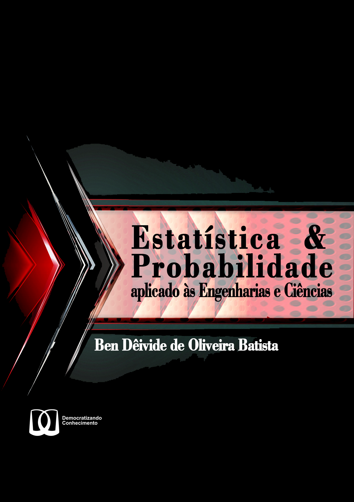

--- 
title: "Estatística & Probabilidade" 
subtitle: "aplicadas às Engenharias e Ciências"

author: "Ben Dêivide de Oliveira Batista"
date: "`r Sys.Date()`"

site: bookdown::bookdown_site

bibliography:
- epaec.bib
biblio-style: apalike
link-citations: yes

cover-image: images/cover.png
colorlinks: yes
graphics: yes
lot: yes
lof: yes

url: 'https://bendeivide.github.io/book-epaec/'
github-repo: bendeivide/book-epaec

---

# Bem-vindo {-}

 Esse é um *livro digital* da 1ª edição do __"[Estatística & Probabilidade aplicado às Engenharias e Ciências]()"__, um livro com o selo **Democratizando Conhecimento** (**DC**). O Livro é voltado para quem deseja iniciar no estudo sobre a estatística. Daremos as bases e fundamentos, de modo aplicado a problemas na área das Engenharias e Ciências, de assuntos desde o que é uma população, amostra, até estudos sobre a teoria de decisão, estudo de regressão, dentre outros assuntos básicos, para que assim, a partir desse material, o leitor tenha base para ler, assuntos mais aprofundados na área da estatística.

O número de leitores  que acessaram esse livro:
 

 <small><a href='https://www.free-website-hit-counter.com' title="Free Website Hit Counter">Free website hit counter</a></small>

## Sugestões e críticas {-}

Sugestões e críticas sobre o livro podem ser enviadas para [livrosdeben@gmail.com](mailto:livrosdeben@gmail.com).

# Livro físico {.unnumbered}

# ISBN {.unnumbered}

- __ISBN__ (Digital): 978-65-01-05500-8
- __ISBN__ (Físico): 978-65-01-05508-4

# Licença {.unnumbered}

:::: {.columns}

::: {.column width="30%" .v-center-container}

 

<a rel="license" href="http://creativecommons.org/licenses/by-nc/4.0/">

:::

::: {.column width="70%"}

</a> Este trabalho está sob a Licença <a rel="license" href="http://creativecommons.org/licenses/by-nc/4.0/">Creative Commons - Atribuição-NãoComercial 4.0 Internacional</a>.

:::

::::

:::: {.columns}

::: {.column width="30%" .v-center-container}

 

:::

::: {.column width="70%"}

Usamos também a filosofia de trabalho com o Selo Democratizando Conhecimento (DC), que pode ser acessada em <https://bendeivide.github.io/dc/>. O leitor é livre para compartilhar, redistribuir, transformar ou adaptar esta obra, desde que não venha a utilizá-la em nenhuma atividade de propósito comercial. Por fim, a única exigência é a atribuição dos créditos aos autores da obra.

:::

::::

 
 

# Como citar {.unnumbered}

- Como citar essa obra (Impressa):

CUSTÓDIO, T. C.; BATISTA, B. D. O.. **Estatística Básica Aplicada às Ciências Agrárias**. Ouro
Branco, MG: [s.n.]. 2024. 336 p. ISBN 978-65-01-05508-4.

- Como citar essa obra (Digital):

CUSTÓDIO, T. C.; BATISTA, B. D. O.. **Estatística Básica Aplicada às Ciências Agrárias**. Ouro
Branco, MG: [s.n.]. 2024. ISBN 978-65-01-05500-8. Disponível em: [https://bendeivide.
github.io/book-estbasica/](https://bendeivide.
github.io/book-estbasica/). Acesso em: 10 de junho de 2024.

# Epígrafe {-}

*O pulsar de minha existência está intensa e totalmente no presente da vida* (Ben Dêivide)

